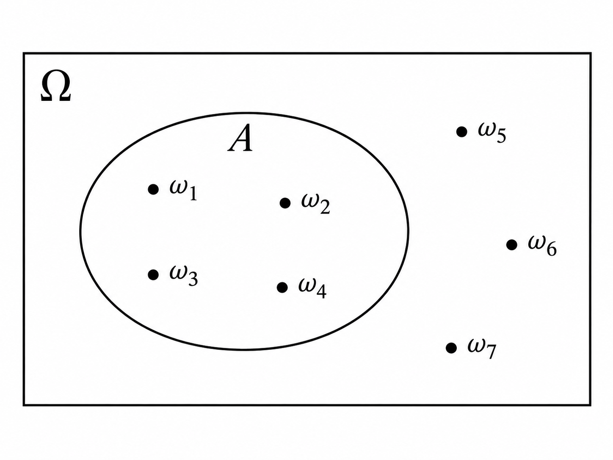

<!--

FONTES PRINCIPAIS PARA ESTA SEÇÃO

Spanos:
- Chapter 2 — Probability Theory: A Modeling Framework
- 2.1 Introduction
- 2.4 Random Experiments
- 2.5 Formalizing Condition [a]: The Outcomes Set
- 2.6 Formalizing Condition [b]: Events and Probabilities
- 2.7–2.8 Random Trials and Statistical Space (visão geral)

Bertsekas & Tsitsiklis:
- Chapter 1 — Sample Space and Probability
- 1.1 Sets
- 1.2 Probabilistic Models

-->

Antes de começarmos, vale dizer que este é o [**coração**]{.atencao} de muita coisa que faremos em Data Science, Machine Learning, Estatística e Inferência Causal.

::: {.callout-note appearance="simple"}

Nesta parte, começaremos um dos passos mais importantes da formação de alguém que trabalha com dados: **aprender a modelar**.

Até agora descrevemos a incerteza de maneira intuitiva. Agora começaremos a transformar essa descrição em uma estrutura matemática precisa.

Esse processo tem um nome fundamental: [**formalização**]{.conceito}.

:::

Vamos aprender a [**formalizar**]{.conceito} aquilo que muitas vezes nos é apresentado de maneira excessivamente informal.

Uma teoria não é simplesmente uma coleção de equações. **As equações aparecem depois.** Antes delas, precisamos definir quais são os objetos do problema, o que cada um significa, quais relações existem entre eles e quais premissas estamos assumindo.

É isso que transforma uma descrição intuitiva de um fenômeno em uma estrutura sobre a qual podemos raciocinar sistematicamente.

## O que exatamente vamos formalizar?

No capítulo anterior partimos de um **fenômeno estocástico**: existe incerteza sobre o resultado individual, mas podem surgir regularidades quando observamos o fenômeno repetidamente.

Para transformar essa ideia em Matemática, nossa formalização acontecerá em **duas grandes etapas**.

::: {.columns}

::: {.column width="48%"}

::: {.callout-note title="1 — Formalizar uma realização"}

Primeiro queremos representar matematicamente **um ensaio do experimento**:

- o que pode acontecer;
- sobre quais acontecimentos queremos falar;
- e como atribuímos probabilidades a eles.

É isso que faremos **neste capítulo**.

:::

:::

::: {.column width="48%"}

::: {.callout-note title="2 — Formalizar repetições"}

Depois perguntaremos:

> **o que acontece quando observamos várias realizações desse mesmo experimento?**

Essa será a próxima etapa da formalização e começará a nos aproximar da ideia de **dados gerados por repetições**.

:::

:::

:::

Em resumo:

$$
\boxed{\text{formalizar uma realização}}
\qquad\longrightarrow\qquad
\boxed{\text{formalizar repetições}}
$$

::: {.callout-important title="O que significa um ensaio?"}

Um **ensaio** é uma realização completa do experimento que definimos.

Se o experimento for "lançar uma moeda duas vezes e registrar a ordem", por exemplo, $HT$ é **um único resultado de um ensaio desse experimento**.

:::

Neste capítulo, portanto, ficaremos **somente na primeira caixa**.

A pergunta que queremos responder é:

> **Onde vive a probabilidade de uma realização do experimento?**

Em muitos cursos mais aplicados, aprendemos rapidamente a calcular probabilidades, usar distribuições e aplicar fórmulas sem parar para construir com cuidado **a estrutura matemática dentro da qual essas probabilidades são definidas**.

É isso que faremos agora.

Para representar matematicamente **um ensaio**, construiremos uma estrutura em **três etapas**, sempre nessa ordem:

$$
\left.
\begin{array}{@{}l l c c@{}}
1. & \text{Quais resultados um ensaio do experimento pode produzir?}
& \quad\longrightarrow\quad & \Omega \\[0.35em]
2. & \text{Quais conjuntos desses resultados vamos admitir como eventos?}
& \quad\longrightarrow\quad & \mathcal{F} \\[0.35em]
3. & \text{Como atribuímos uma probabilidade a cada um desses eventos?}
& \quad\longrightarrow\quad & P
\end{array}
\right\}
\quad\Longrightarrow\quad
\boxed{(\Omega,\mathcal{F},P)}
$$

O objeto $(\Omega,\mathcal F,P)$ é chamado de [**Espaço de Probabilidade**]{.conceito} (*Probability Space*).

Essas serão exatamente as três partes deste capítulo:

1. **$\Omega$ — Espaço amostral:** quais resultados são possíveis?

2. **$\mathcal F$ — Família de eventos:** sobre quais conjuntos desses resultados queremos falar?

3. **$P$ — Lei de probabilidade:** como quantificamos a incerteza sobre esses eventos?

::: {.callout-important title="A ideia é construir, não decorar"}

Não vamos começar decorando $(\Omega,\mathcal F,P)$.

Vamos construir uma peça de cada vez. Quando chegarmos ao final, a notação terá surgido naturalmente porque cada objeto resolve uma pergunta diferente.

:::

Ao final deste capítulo teremos, portanto, formalizado matematicamente **uma realização do experimento**.

No próximo, daremos o segundo passo:

> **como representar várias realizações desse experimento e começar a construir a ponte entre Probabilidade e dados observados?**

## 1. Espaço amostral ($\Omega$)

::: {.callout-note title="Etapa 1 de 3"}

**Pergunta-guia:** quais resultados um ensaio do experimento pode produzir?

Nosso primeiro objetivo é construir $\Omega$.

:::

### O experimento

Para transformar um fenômeno incerto em um objeto matemático, precisamos primeiro dizer exatamente:

> **Qual é o procedimento cujo resultado queremos observar?**

Chamaremos esse procedimento de **experimento**.

Por exemplo:

> lançar uma moeda uma vez e observar a face que aparece.

Quando realizamos esse experimento, observamos exatamente um resultado: $H$ ou $T$.

Da mesma forma, podemos definir o experimento:

> lançar dois dados uma vez e registrar os números obtidos.

Uma possível realização produz $(2,5)$. Outra pode produzir $(6,1)$. Outra, $(3,3)$.

### Experimento e ensaio

Vamos manter uma terminologia importante que já apareceu no capítulo anterior.

O **experimento** é o procedimento que definimos.

Por exemplo: lançar dois dados e observar o resultado.

Cada vez que realizamos esse mesmo procedimento temos um **ensaio** (*trial*).

Assim, podemos pensar em um mesmo experimento sendo realizado em vários ensaios:

$\text{Ensaio}_1,\text{Ensaio}_2,\text{Ensaio}_3,\ldots$

Cada ensaio produz exatamente **um resultado**.

Por exemplo: $(2,5)$, $(6,1)$, $(3,3)$, $\ldots$

O experimento descreve **o que será feito**.

O ensaio é **uma realização desse experimento**.

O resultado é **aquilo que observamos nessa realização**.

::: {.callout-note title="Uma distinção importante"}

Tudo depende de como definimos o experimento.

Se o experimento for

> lançar uma moeda uma vez e observar a face,

um resultado é simplesmente

$H$ ou $T$.

Mas suponha que o experimento seja

> lançar uma moeda três vezes e registrar, na ordem, os três resultados.

Agora, um único resultado precisa guardar **três informações**:

- o resultado do primeiro lançamento;
- o resultado do segundo;
- o resultado do terceiro.

Por exemplo,

$$
(H,T,H)
$$

é **um único resultado de um único ensaio desse experimento**.

Os três lançamentos fazem parte da definição do experimento. Não são, nesse caso, três experimentos diferentes.

:::

### Os resultados possíveis

Antes de realizar um experimento, não sabemos qual resultado particular será observado.

Mas precisamos saber **quais resultados são possíveis**.

Considere novamente:

> lançar uma moeda uma vez.

Antes de realizar o experimento, sabemos que o resultado será $H$ ou $T$.

Não sabemos **qual** ocorrerá.

Mas sabemos **quais podem ocorrer**.

Essa distinção é fundamental: o **resultado observado** é desconhecido antes do ensaio, enquanto o **conjunto dos resultados possíveis** é especificado pelo modelo.

### Definindo o espaço amostral

Chamamos o conjunto de todos os resultados possíveis de um experimento de **espaço amostral** (*sample space*).

Vamos representá-lo por $\Omega$.

No lançamento de uma moeda,

$$
\Omega=\{H,T\}.
$$

Cada elemento de $\Omega$ representa um possível resultado do experimento.

Costumamos representar um resultado particular pela letra grega minúscula $\omega$.

Portanto,

$$
\omega\in\Omega.
$$

Antes do experimento, sabemos que algum elemento de $\Omega$ será observado.

Não sabemos qual.

Depois que o experimento é realizado, um determinado $\omega$ se realiza.

### Exemplo: um dado

Considere o experimento:

> lançar um dado de seis faces e observar o número da face superior.

O espaço amostral é

$$
\Omega=\{1,2,3,4,5,6\}.
$$

Se o dado for lançado e observarmos $\omega=4$, então $4$ foi o resultado realizado.

Mas antes do lançamento nosso modelo precisava contemplar todos os resultados possíveis.

### Quando um resultado precisa guardar mais de uma informação

Até agora, em exemplos como uma moeda ou um dado, cada resultado carregava apenas **uma informação**.

Mas um resultado também pode precisar registrar várias coisas ao mesmo tempo.

Considere o experimento:

> lançar uma moeda duas vezes e registrar, na ordem, o resultado dos dois lançamentos.

Cada lançamento possui as possibilidades

$$
\{H,T\}.
$$

Como precisamos registrar **o primeiro e o segundo lançamento**, combinamos as possibilidades dos dois.

É aqui que aparece o [**produto cartesiano**]{.conceito}.

Dados dois conjuntos $A$ e $B$, o produto cartesiano

$$
A\times B
$$

é o conjunto de todos os **pares ordenados** em que o primeiro elemento vem de $A$ e o segundo vem de $B$.

No nosso exemplo:

$$
\Omega
=
\{H,T\}\times\{H,T\}.
$$

Portanto,

$$
\Omega
=
\{
(H,H),(H,T),(T,H),(T,T)
\}.
$$

Perceba o que aconteceu.

Com um lançamento, um resultado poderia ser simplesmente

$$
\omega=H.
$$

Com dois lançamentos, precisamos registrar duas informações:

$$
\omega=(H,T).
$$

O espaço amostral ganhou uma estrutura adicional porque **o próprio resultado do experimento passou a ter mais de um componente**.

Isso também explica por que

$$
(H,T)\neq(T,H).
$$

Como os pares são ordenados, $(H,T)$ significa cara no primeiro lançamento e coroa no segundo, enquanto $(T,H)$ significa exatamente o contrário.

::: {.callout-tip title="A ideia por trás do produto cartesiano"}

Quando um resultado precisa registrar mais de uma informação, podemos combinar os conjuntos de possibilidades de cada componente:

$$
\boxed{
\text{possibilidades do primeiro componente}
\times
\text{possibilidades do segundo componente}
}
$$

O produto cartesiano constrói **todas as combinações possíveis**.

Essa mesma ideia aparecerá várias vezes ao longo do curso.

:::

### Exemplo: dois dados

Agora considere:

> lançar dois dados e observar o resultado de cada dado.

Cada dado possui como possíveis resultados

$$
\{1,2,3,4,5,6\}.
$$

Como precisamos registrar o resultado **do primeiro e do segundo dado**, construímos

$$
\Omega
=
\{1,2,3,4,5,6\}
\times
\{1,2,3,4,5,6\}.
$$

Cada elemento de $\Omega$ é um par ordenado

$$
\omega=(i,j),
$$

onde $i$ é o resultado do primeiro dado e $j$ o resultado do segundo.

Por exemplo,

$$
(2,5),\qquad(6,1),\qquad(3,3).
$$

Como existem $6$ possibilidades para o primeiro componente e $6$ para o segundo,

$$
|\Omega|=6\times6=36.
$$

### Espaços amostrais podem ter tamanhos diferentes

Até aqui usamos exemplos com poucos resultados possíveis, mas $\Omega$ não precisa ser finito.

Na verdade, existem três situações importantes.

#### 1. Espaço amostral finito

Um espaço amostral é **finito** quando possui um número limitado de resultados possíveis.

Por exemplo, ao lançar um dado de seis faces:

$$
\Omega=\{1,2,3,4,5,6\}.
$$

Podemos literalmente listar todos os resultados possíveis e terminar a lista.

O mesmo acontece com uma moeda:

$$
\Omega=\{H,T\}.
$$

---

#### 2. Espaço amostral infinito enumerável

Agora imagine que queremos registrar:

> **quantas chamadas chegam a um sistema durante determinado período?**

Os resultados possíveis são:

$$
\Omega=\{0,1,2,3,\ldots\}.
$$

Não existe um último número possível nessa lista.

Portanto, $\Omega$ possui **infinitos elementos**.

Mas existe algo importante: ainda conseguimos imaginar os resultados sendo listados, um depois do outro:

$$
0,1,2,3,4,\ldots
$$

Por isso dizemos que esse conjunto é **infinito enumerável** (*countably infinite*).

Outro exemplo seria o número de tentativas até um usuário conseguir concluir determinado processo:

$$
1,2,3,4,\ldots
$$

Novamente, existem infinitas possibilidades, mas elas podem ser organizadas em uma sequência.

---

#### 3. Espaço amostral infinito não enumerável

Agora considere outra pergunta:

> **quanto tempo um usuário leva para concluir o checkout?**

Poderíamos representar os resultados possíveis por

$$
\Omega=[0,\infty).
$$

Mas o que significa esse intervalo?

Ele contém não apenas $1$, $2$, $3$, etc., mas qualquer valor intermediário possível:

$$
1.2,\;1.23,\;1.234,\;1.2345,\ldots
$$

E isso não acontece apenas entre $1$ e $2$.

Entre **quaisquer dois valores diferentes**, por mais próximos que estejam, existem infinitos outros valores.

Por exemplo, entre $1.2$ e $1.3$ temos

$$
1.21,\;1.211,\;1.212,\;1.25,\ldots
$$

Não existe um "próximo número" depois de $1.2$ da mesma forma que existe um próximo inteiro depois de $1$.

Por isso não conseguimos listar esses resultados um a um como fizemos com

$$
\{0,1,2,3,\ldots\}.
$$

Chamamos esse tipo de conjunto de **infinito não enumerável** (*uncountably infinite*).

---

Portanto, podemos ter:

- **finito:** $\Omega=\{H,T\}$;
- **infinito enumerável:** $\Omega=\{0,1,2,3,\ldots\}$;
- **infinito não enumerável:** $\Omega=[0,\infty)$.

::: {.callout-important title="Infinito não é tudo a mesma coisa"}

Os conjuntos

$$
\{0,1,2,3,\ldots\}
$$

e

$$
[0,\infty)
$$

possuem ambos infinitos elementos.

Mas são infinitos de naturezas diferentes.

No primeiro, conseguimos conceitualmente **enumerar** os resultados:

$$
0,1,2,3,\ldots
$$

No segundo, isso não é possível: dentro de qualquer pequeno intervalo continuam existindo infinitas possibilidades.

Essa diferença parecerá muito menos abstrata quando começarmos a trabalhar com variáveis **discretas** e **contínuas**.

:::

::: {.callout-tip title="Onde isso vai aparecer na prática?"}

Essa distinção está por trás de algo que usamos o tempo inteiro em Data Science.

Considere três coisas que poderíamos registrar:

- **forma de pagamento:** cartão, Pix ou boleto;
- **número de compras de um cliente:** $0,1,2,3,\ldots$;
- **tempo até concluir uma compra:** $2.31$, $2.314$, $2.3147,\ldots$ segundos.

Esses objetos têm naturezas diferentes.

A forma de pagamento assume **categorias**.

O número de compras assume valores que podemos **contar**.

O tempo pode, pelo menos matematicamente, assumir qualquer valor dentro de um **intervalo**.

Mais adiante, quando introduzirmos variáveis aleatórias, veremos que essa diferença ajuda a entender de onde vêm ideias como **variáveis categóricas, discretas e contínuas** — e por que não usamos exatamente as mesmas ferramentas probabilísticas para todas elas.

:::

Por enquanto, não precisamos desenvolver nenhuma teoria adicional.

A ideia importante é apenas perceber que o conjunto de resultados possíveis pode ter estruturas muito diferentes — e que essa estrutura terá consequências para a forma como representaremos probabilidades mais adiante.

### O espaço amostral depende da pergunta

Existe aqui uma ideia muito mais importante do que pode parecer inicialmente:

> **o espaço amostral não é simplesmente uma lista que "vem pronta" da realidade.**

Ele faz parte da forma como decidimos representar o problema.

**→ Considere um usuário chegando ao checkout de um e-commerce.**

Se nossa pergunta for apenas:

> **O usuário realizará uma compra?**

podemos construir um espaço amostral simples:

$$
\Omega=\{\text{compra},\text{não compra}\}.
$$

Agora imagine que queremos registrar mais informação:

> **Se houver uma compra, qual será a forma de pagamento utilizada?**

O resultado precisa agora distinguir diferentes possibilidades de compra.

Podemos definir:

$$
\Omega=
\{
(\text{compra},\text{cartão}),
(\text{compra},\text{Pix}),
(\text{compra},\text{boleto}),
(\text{não compra})
\}.
$$

A situação real pode ser exatamente a mesma.

O que mudou foi **a informação que decidimos registrar** e, consequentemente, nossa **representação matemática** do fenômeno.

Perceba que isso é uma versão da mesma ideia que vimos com duas moedas e dois dados: quando queremos guardar mais informação sobre o resultado, precisamos enriquecer a estrutura de $\omega$ e, consequentemente, de $\Omega$.

---

**→ Agora considere um problema extremamente comum em Data Science: churn.**

Suponha que acompanhamos um cliente durante determinado período e queremos registrar apenas uma coisa:

> **O cliente cancelará ou permanecerá ativo?**

Um espaço amostral possível é simplesmente

$$
\Omega=\{\text{churn},\text{não churn}\}.
$$

Temos apenas dois resultados possíveis. Portanto, estamos novamente diante de um espaço amostral **finito e discreto**.

Esse exemplo extremamente simples está por trás de problemas muito familiares na indústria.

Mais adiante, quando introduzirmos **variáveis aleatórias**, poderemos representar esses dois resultados numericamente, por exemplo:

$$
Y=1
$$

para churn e

$$
Y=0
$$

para não churn.

E quando estudarmos modelos estatísticos, poderemos fazer uma pergunta ainda mais interessante:

> **Qual é a probabilidade de churn para um cliente com determinadas características?**

É exatamente o tipo de problema em que aparece, por exemplo, a **regressão logística** (*logistic regression*).

::: {.callout-tip title="Do espaço amostral ao Machine Learning"}

É interessante perceber a sequência.

Começamos com algo aparentemente elementar:

$$
\Omega=\{\text{churn},\text{não churn}\}.
$$

Mais adiante, esses resultados poderão ser representados por uma variável $Y\in\{0,1\}$ e poderemos modelar a probabilidade de observar $Y=1$ dadas determinadas características do cliente.

É daí que surgem muitos problemas que, na prática, chamamos de **classificação binária** (*binary classification*).

Problemas de *churn prediction*, conversão, fraude ou inadimplência não começam no algoritmo.

Antes de qualquer modelo, existe uma pergunta muito mais básica:

> **quais são os resultados possíveis do fenômeno que estamos tentando representar?**

:::

::: {.callout-important title="Modelar significa escolher o que representar"}

Um bom espaço amostral deve distinguir os resultados necessários para responder às perguntas que queremos fazer — sem carregar detalhes que não importam para o problema.

Portanto, antes mesmo de atribuir probabilidades, já estamos tomando uma decisão de modelagem:

> **Que aspectos da realidade precisamos representar?**

:::

### O espaço amostral precisa cobrir todas as possibilidades

São duas as condições importantes nessa construção:

- **coletivamente exaustivo:** todos os resultados que podem ocorrer estão representados em $\Omega$; nenhum resultado possível ficou de fora;
- **mutuamente exclusivo:** em cada realização do experimento, apenas um desses resultados ocorre.

#### Coletivamente exaustivo

Existe uma condição importante na construção de $\Omega$:

> **Depois que o experimento for realizado, o resultado observado precisa necessariamente estar dentro do espaço amostral que definimos.**

Quando isso acontece, dizemos que os resultados em $\Omega$ são **coletivamente exaustivos**.

"Coletivamente exaustivos" significa simplesmente:

> **juntos, eles esgotam todas as possibilidades.**

Considere o experimento:

> lançar uma moeda duas vezes e registrar, na ordem, o resultado dos dois lançamentos.

Já vimos que

$$
\Omega
=
\{H,T\}\times\{H,T\}
=
\{
(H,H),(H,T),(T,H),(T,T)
\}.
$$

Por que precisamos tanto de $(H,T)$ quanto de $(T,H)$?

Porque eles representam resultados diferentes:

- $(H,T)$: primeiro saiu cara e depois coroa;
- $(T,H)$: primeiro saiu coroa e depois cara.

Se definíssemos

$$
\Omega=
\{
(H,H),(H,T),(T,T)
\},
$$

o espaço amostral estaria incompleto.

Se o experimento produzisse primeiro $T$ e depois $H$, teríamos observado um resultado possível que **não existe em $\Omega$**.

Portanto, esse espaço amostral não seria coletivamente exaustivo.

::: {.callout-warning title="O erro que essa ideia evita"}

A exaustividade funciona como uma checagem de sanidade do modelo:

> **existe alguma coisa que pode acontecer no mundo, mas que nosso espaço amostral esqueceu de representar?**

No exemplo das moedas, esquecer $(T,H)$ produz exatamente esse problema.

Em dados reais, a mesma falha aparece quando criamos categorias para um processo e deixamos de fora um estado que pode realmente ocorrer.

:::

::: {.callout-note title="Mas $(H,T)$ e $(T,H)$ precisam sempre ser separados?"}

Não.

Tudo depende do que definimos como resultado do experimento.

Se nosso experimento for

> lançar uma moeda duas vezes e registrar a sequência,

então $(H,T)$ e $(T,H)$ são resultados diferentes e precisamos de

$$
\Omega
=
\{
(H,H),(H,T),(T,H),(T,T)
\}.
$$

Mas suponha que nosso experimento seja

> lançar uma moeda duas vezes e registrar apenas o número de caras.

Agora não nos interessa a ordem.

Os possíveis resultados são simplesmente

$$
\Omega=\{0,1,2\}.
$$

Tanto $(H,T)$ quanto $(T,H)$ correspondem ao mesmo resultado nessa nova representação:

$$
1\text{ cara}.
$$

Os dois espaços amostrais são válidos.

Eles representam aspectos diferentes do mesmo fenômeno.

:::

Isso reforça uma ideia que vimos anteriormente:

> **o espaço amostral depende daquilo que escolhemos observar e das perguntas que queremos responder.**

Há ainda uma segunda condição.

#### Mutuamente exclusivo

Os elementos de $\Omega$ devem ser definidos de maneira que, ao realizar o experimento, possamos identificar **um único resultado**.

Dizemos que os resultados são **mutuamente exclusivos**.

No experimento em que registramos a sequência das duas moedas, se observamos

$$
(H,T),
$$

não observamos simultaneamente

$$
(H,H),\qquad(T,H)\qquad\text{ou}\qquad(T,T).
$$

Assim:

- **coletivamente exaustivos:** todos os resultados que podem ocorrer estão representados em $\Omega$; nenhum resultado possível ficou de fora;
- **mutuamente exclusivos:** apenas um deles ocorre em cada realização.

Juntas, as duas ideias nos dão:

$$
\boxed{\text{em cada realização do experimento, exatamente um } \omega\in\Omega \text{ ocorre}.}
$$

::: {.callout-tip title="Teste seu entendimento"}

Lançamos uma moeda duas vezes e queremos registrar **apenas se as duas faces foram iguais ou diferentes**.

Qual dos seguintes espaços amostrais representa corretamente esse experimento?

1. $\Omega=\{(H,H),(H,T),(T,H),(T,T)\}$

2. $\Omega=\{\text{iguais},\text{diferentes}\}$

3. $\Omega=\{(H,H),(H,T),(T,T)\}$

O segundo é suficiente para a pergunta que escolhemos responder.

O primeiro também contém informação suficiente, mas registra mais detalhes do que precisamos.

O terceiro não é válido se estivermos registrando a sequência completa, pois deixou de fora o resultado possível $(T,H)$.

:::

**Podemos resumir as duas condições assim:**

$$
\begin{gathered}

\underbrace{\text{pelo menos um resultado ocorre}}_{\text{exaustividade}}

\;+\;

\underbrace{\text{no máximo um resultado ocorre}}_{\text{exclusividade}}

\qquad \Longrightarrow

\\[0.8em]

\Longrightarrow \qquad

\underbrace{\text{exatamente um resultado ocorre}}_{\text{as duas juntas}}

\end{gathered}
$$

Veja como a matemática vem justamente para **esclarecer coisas que, intuitivamente, às vezes podem parecer óbvias ou até confusas**.

Quando dizemos que os resultados são coletivamente exaustivos e mutuamente exclusivos, estamos transformando em condições precisas uma ideia muito simples:

> ao realizar o experimento, nenhum resultado possível pode ter sido esquecido e não pode haver ambiguidade sobre qual resultado ocorreu.

### Fechando a primeira peça

Construímos a primeira parte do Espaço de Probabilidade:

$$
\boxed{\Omega}
$$

Agora sabemos representar **todos os resultados que um ensaio do experimento pode produzir**.

E vimos também que um resultado $\omega$ não precisa carregar apenas uma informação: quando o experimento exige várias, podemos construir espaços mais ricos usando estruturas como o **produto cartesiano**.

Mas ainda não atribuímos nenhuma probabilidade.

Antes disso, precisamos decidir quais **conjuntos de resultados** queremos tratar como objetos probabilísticos.

É daí que nasce a segunda peça: $\mathcal F$.

## 2. Família de eventos ($\mathcal F$)

::: {.callout-note title="Etapa 2 de 3"}

**Pergunta-guia:** sobre quais acontecimentos do experimento queremos ser capazes de atribuir probabilidades?

Já construímos $\Omega$, o conjunto de todos os resultados possíveis.

Agora precisamos construir os objetos aos quais, na próxima etapa, atribuiremos probabilidades.

Esses objetos são os **eventos**.

:::

### Eventos: transformando perguntas reais em conjuntos

Olha que nuance interessante:

- quando realizamos um experimento (ou um ensaio desse experimento), observamos apenas **um único resultado** $\omega\in\Omega$;
- mas, na prática, queremos calcular probabilidades de perguntas muito mais amplas do que simplesmente **qual resultado específico será observado**.

Por exemplo, em vez de perguntar apenas:

> **Qual é a probabilidade de observar exatamente $HT$?**

queremos responder perguntas como:

> **Qual é a probabilidade de sair pelo menos uma cara em dois lançamentos?**

> **Qual é a probabilidade de um usuário realizar uma compra, independentemente da forma de pagamento?**

> **Qual é a probabilidade de um cliente cancelar sua assinatura nos próximos 30 dias?**

Como representamos matematicamente perguntas desse tipo?

É justamente para isso que introduzimos os **eventos**, pois a matemática representa essas perguntas por meio de **eventos**.

Considere o experimento de lançar uma moeda duas vezes:

$\Omega=\{HH,HT,TH,TT\}$.

A pergunta

> **Saiu exatamente uma cara?**

é satisfeita pelos resultados $HT$ e $TH$.

Podemos reuni-los no conjunto $A=\{HT,TH\}$.

Esse conjunto é um **evento**:

- um subconjunto de $\Omega$ que representa alguma possível afirmação ou possível pergunta sobre o experimento.

$$
\boxed{
\text{pergunta mais interessante}
\longrightarrow
\text{evento }A
\longrightarrow
A\subseteq\Omega
\text{ (contexto de possíveis resultados)}
}
$$

{.course-figure width="50%"}

Quando realizamos o experimento, observamos um único resultado $\omega$.

Se $\omega\in A$, dizemos que **o evento $A$ ocorreu**.

Por exemplo, se

$A=\{HT,TH\}$

representa a pergunta

> **Saiu exatamente uma cara?**

e observamos $\omega=HT$, então $\omega\in A$ e dizemos que o evento $A$ ocorreu.

::: {.callout-important title="Resultado e evento não são a mesma coisa"}

O **resultado** é aquilo que observamos em uma realização do experimento.

O **evento** é um conjunto de resultados que representa alguma pergunta ou acontecimento de interesse.

Por isso, observar $HT$ não significa que $HT$ e $TH$ ocorreram ao mesmo tempo. Significa apenas que o resultado observado pertence ao conjunto

$A=\{HT,TH\}$.

Essa linguagem é importante porque conecta a matemática ao experimento real:

> dizer que **$A$ ocorreu** significa simplesmente que o resultado observado pertence a $A$.

E é justamente sobre eventos que queremos fazer perguntas probabilísticas:

> **Qual é a probabilidade de o evento $A$ ocorrer?**

:::

### Combinando perguntas

> E se quisermos fazer perguntas ainda mais complexas? 

A estrutura matemática que essa formalização está construindo, precisa se capaz de permitir isso.

Como eventos são conjuntos, operações entre conjuntos permitem representar perguntas mais complexas.

Se

$A=$ "a primeira moeda é cara" e  
$B=$ "a segunda moeda é cara",

então:

- $A\cap B$: **$A$ e $B$ ocorrem**;
- $A\cup B$: **$A$ ou $B$ ocorre**;
- $A^c$: **$A$ não ocorre**.

É por isso que a Teoria dos Conjuntos aparece aqui: 

- ela fornece uma linguagem precisa para combinar perguntas sobre o experimento.

Um único resultado também pode fazer vários eventos ocorrerem.

Se $\omega=HH$, por exemplo, então $\omega\in A$ e $\omega\in B$. Portanto, $A$ e $B$ ocorreram. 

Ou seja:

- $HH\in A$: a resposta para **"a primeira moeda é cara?"** é sim;
- $HH\in B$: a resposta para **"a segunda moeda é cara?"** também é sim.

Portanto, dizemos que **os eventos $A$ e $B$ ocorreram**.

### Dois eventos especiais

A própria estrutura dos conjuntos na matemática nos dá ainda dois eventos interessantes.

- Como um conjunto por ser subconjunto de si mesmo ($\Omega\subseteq\Omega$), o próprio $\Omega$ é um possível evento. Chamamos esse caso de **evento certo** (*certain event*), pois algum resultado de $\Omega$ necessariamente ocorre em toda realização do experimento. Por isso, mais adiante veremos que $P(\Omega)=1$: ou seja, o espaço amostral inteiro tem **100% de probabilidade de ocorrer**.

- E como $\varnothing\subseteq\Omega$, o conjunto vazio também é um evento: o **evento impossível** (*impossible event*), pois nenhum resultado possível do experimento pertence a ele. Por isso, mais adiante veremos que $P(\varnothing)=0$: ou seja, o evento impossível tem **0% de probabilidade de ocorrer**.

### De eventos para uma família de eventos

Agora temos vários eventos — $A$, $B$, $A^c$, $A\cup B$, etc.

Como queremos atribuir probabilidades a eles, precisamos reuni-los em uma **coleção**.

Na matemática, uma coleção de conjuntos é frequentemente chamada de uma [**família**]{.conceito} de conjuntos.

Chamaremos nossa família de eventos de $\mathcal F$.

Assim:

- $\omega\in\Omega$: um **resultado possível** é um elemento do espaço amostral;
- $A\subseteq\Omega$: um **evento** é um subconjunto do espaço amostral;
- $A\in\mathcal F$: $A$ pertence à **família de eventos** considerada, ou seja, é um elemento de $\mathcal F$ (e **não** um subconjunto!).

Mas existe uma exigência natural.

Até aqui chamamos $\mathcal F$ de nossa **família de eventos**. Podemos agora dar um nome um pouco mais formal a essa coleção: ela será o nosso [**espaço de eventos**]{.conceito}.

A ideia é que esse espaço não contenha apenas os eventos que nos interessam originalmente, como $A$ e $B$.

Se conseguimos perguntar:

- **"$A$ ocorreu?"**
- **"$B$ ocorreu?"**

também queremos conseguir perguntar:

- **"$A$ não ocorreu?"**
- **"$A$ ou $B$ ocorreu?"**
- **"$A$ e $B$ ocorreram?"**

Essas novas perguntas correspondem aos eventos $A^c$, $A\cup B$ e $A\cap B$.

Por isso, queremos que, ao combinar eventos que já pertencem a $\mathcal F$, os novos eventos produzidos **continuem pertencendo a $\mathcal F$**.

Na matemática, dizemos que uma coleção é [**fechada sob uma operação**]{.conceito} quando aplicamos essa operação aos seus elementos e o resultado continua dentro da própria coleção.

Por exemplo:

- os números inteiros são **fechados sob adição**, porque a soma de dois inteiros continua sendo um inteiro;
- mas **não são fechados sob divisão**, porque, por exemplo, $1/2$ não é inteiro.

No nosso caso, queremos que o espaço de eventos seja **fechado sob operações de conjuntos**.

Assim:

- se $A\in\mathcal F$, então queremos também $A^c\in\mathcal F$;
- se $A,B\in\mathcal F$, então queremos $A\cup B\in\mathcal F$;
- e também $A\cap B\in\mathcal F$.

Ou seja,

> **o espaço de eventos é uma coleção de subconjuntos de $\Omega$ que permanece estável quando aplicamos a ela as operações de conjuntos que precisamos usar.**

Isso é justamente o que significa dizer que, nesse caso, $\mathcal F$ é **fechado sob complemento, união e interseção** (ou como apresentamos inicialmente, **fechado sob operações de conjuntos**).

::: {.callout-note title="No caso finito, a ideia é simples"}

Lembra da época da escola quando aprendemos sobre o **conjunto das partes**?

Considere, por exemplo, o conjunto $S=\{1,2\}$.

Podemos formar os seguintes subconjuntos de $S$:

$$
\varnothing,\qquad
\{1\},\qquad
\{2\},\qquad
\{1,2\}.
$$

A coleção formada por **todos os subconjuntos de $S$** é chamada de **conjunto das partes** (*power set*) e pode ser representada por $2^S$:

$$
2^S=
\{
\varnothing,
\{1\},
\{2\},
\{1,2\}
\}.
$$

Agora estamos usando exatamente a mesma ideia em Probabilidade. Para um único lançamento de moeda, $\Omega=\{H,T\}$. Todos os subconjuntos de $\Omega$ são:

$$
\mathcal F=
\{
\varnothing,
\{H\},
\{T\},
\Omega
\}.
$$

Só que agora cada um desses subconjuntos tem uma interpretação como **evento**:

- $\{H\}$: saiu cara;
- $\{T\}$: saiu coroa;
- $\Omega$: saiu cara ou coroa — o **evento certo**;
- $\varnothing$: ocorreu algo impossível — o **evento impossível**.

Ou seja, nesse caso estamos simplesmente tomando como nossa família de eventos **todos os subconjuntos de $\Omega$**: $\mathcal F=2^\Omega$.

E agora chegamos exatamente onde queríamos. Temos uma coleção com todos os eventos sobre os quais queremos ser capazes de perguntar:

> **Qual é a probabilidade de sair cara?**

> **Qual é a probabilidade de sair coroa?**

> **Qual é a probabilidade do evento certo?**

> **E do evento impossível?**

Os eventos já estão definidos e organizados em $\mathcal F$.

**_E agora?_**

Agora falta uma regra que pegue cada evento dessa família e diga **quão provável ele é**.

Essa será nossa terceira peça: $P$.

Mais adiante, escreveremos essa ideia como

$$
\mathcal F
\;\xrightarrow{\quad P\quad}\;
[0,1].
$$

Em espaços finitos pequenos, frequentemente podemos trabalhar dessa forma e simplesmente tomar o **conjunto das partes** como nosso espaço de eventos: $\mathcal F=2^\Omega$.

Mas existe uma primeira sutileza importante: o conjunto das partes cresce **muito rapidamente**.

Se $\Omega$ possui $N$ resultados possíveis, então $2^\Omega$ possui

$$
2^N
$$

subconjuntos — isto é, $2^N$ eventos possíveis.

Com uma única moeda, temos apenas $2$ resultados e, portanto, $2^2=4$ subconjuntos. Nada demais.

Mas, se lançarmos uma moeda três vezes e registrarmos a sequência, teremos $8$ resultados possíveis. O conjunto das partes já terá $2^8=256$ eventos.

Ou seja:

> **não precisamos necessariamente colocar em $\mathcal F$ todos os eventos matematicamente possíveis se apenas alguns deles são relevantes para o problema que queremos modelar.**

Essa é uma primeira razão, bastante prática, para distinguir **espaço de eventos** de **conjunto das partes**.

E a situação cresce ainda mais rápido quando $\Omega$ é infinito.

Por exemplo, considere um espaço enumerável como $\Omega=\{0,1,2,3,\ldots\}$.

Os elementos de $\Omega$ podem ser listados um a um. Porém, seu conjunto das partes $2^\Omega$ já é **não enumerável**: existem tantos subconjuntos de $\Omega$ quanto números reais.

Ou seja, algo interessante aconteceu:

$$
\boxed{\Omega\text{ é enumerável}}
\qquad\text{mas}\qquad
\boxed{2^\Omega\text{ não é enumerável}.}
$$

Isso mostra como o conjunto das partes pode se tornar enorme mesmo quando o próprio espaço amostral ainda parece relativamente simples.

E existe ainda uma segunda sutileza, agora **matemática**.

Quando $\Omega$ é não enumerável, como acontece ao modelarmos uma quantidade contínua, por exemplo o tempo necessário para concluir um checkout, nem sempre podemos tratar **todos** os elementos de $2^\Omega$ como eventos aos quais uma probabilidade pode ser atribuída de maneira consistente.

Não precisamos entender essa dificuldade ainda.

Por enquanto, guarde apenas:

> **$\mathcal F$ é o nosso espaço de eventos e não precisa ser igual ao conjunto das partes $2^\Omega$.**

Nos casos finitos mais simples, muitas vezes usamos $\mathcal F=2^\Omega$ porque isso é conveniente.

Mais adiante veremos por que, em espaços infinitos e principalmente contínuos, precisamos escolher $\mathcal F$ com um pouco mais de cuidado.

:::

### Fechando a segunda peça

Já construímos duas partes do espaço de probabilidade:

$$
\boxed{\Omega}
\qquad\longrightarrow\qquad
\boxed{\mathcal F}.
$$

$\Omega$ reúne os **resultados possíveis**.

$\mathcal F$ reúne (todos os possíveis) **eventos sobre os quais queremos atribuir probabilidades**.

Agora podemos [**finalmente**]{.atencao} perguntar:

> **Quão provável é cada evento?**

Essa é a função da terceira peça: $P$.

## 3. Lei de probabilidade ($P$)

::: {.callout-note title="Etapa 3 de 3"}

**Pergunta-guia:** como atribuímos uma probabilidade a cada evento de $\mathcal F$?

Já construímos:

- $\Omega$: os resultados que podem ocorrer;
- $\mathcal F$: os eventos sobre os quais queremos fazer perguntas probabilísticas.

Agora construiremos a terceira e última peça do Espaço de Probabilidade: $P$.

:::

### Antes: o que é mesmo uma função?

Vale relembrar rapidamente uma ideia básica.

Uma **função** é uma regra que associa a cada elemento de um conjunto exatamente um elemento de outro conjunto.

Por exemplo, considere

$$
f:\{1,2,3\}\longrightarrow\mathbb R,
\qquad
f(x)=x^2.
$$

A função pega cada elemento do domínio e associa a ele uma imagem:

$$
1 \xrightarrow{\;f\;} 1,
\qquad
2 \xrightarrow{\;f\;} 4,
\qquad
3 \xrightarrow{\;f\;} 9.
$$

Assim:

- **domínio:** $\{1,2,3\}$ — os elementos que podem entrar na função;
- **contradomínio:** $\mathbb R$ — o conjunto no qual as saídas devem estar;
- **imagem da função:** $\{1,4,9\}$ — os valores que efetivamente aparecem como saída.

De forma geral, para um elemento $x$ do domínio, podemos representar a ação da função assim:

$$
x
\quad\xrightarrow{\;f\;}\quad
f(x).
$$

Guarde essa imagem, porque é exatamente a mesma estrutura que usaremos agora.

### Uma função cujas entradas são conjuntos

A lei de probabilidade será uma função

$$
P:\mathcal F\longrightarrow[0,1].
$$

Compare com o que acabamos de ver:

$$
x
\quad\xrightarrow{\;f\;}\quad
f(x)
$$

e agora:

$$
A
\quad\xrightarrow{\;P\;}\quad
P(A).
$$

A lógica é a mesma.

A diferença importante está no **tipo de objeto que entra na função**.

Na função $f$, entrava um elemento $x$.

Na função $P$, entra um **evento** $A\in\mathcal F$ (e eventos são conjuntos).

A função $P$ associa então a esse evento um número entre $0$ e $1$ (mais a frente falamos sobre isso):

$$
A
\quad\xrightarrow{\;P\;}\quad
P(A)\in[0,1].
$$

Esse número $P(A)$ representa a **probabilidade de o evento $A$ ocorrer**.

Por exemplo, no lançamento de uma moeda justa:

$$
\Omega=\{H,T\}
$$

e

$$
\mathcal F=\{\varnothing,\{H\},\{T\},\Omega\}
$$

Pensamos em alguma regras de associação e podemos definir a função $P$ por:

$$
\begin{aligned}
P(\varnothing)&=0,\\
P(\{H\})&=0.5,\\
P(\{T\})&=0.5,\\
P(\Omega)&=1.
\end{aligned}
$$

Podemos visualizar um elemento sendo associado, por exemplo:

$$
\{H\}
\quad\xrightarrow{\;P\;}\quad
0.5.
$$

Ou seja, a imagem do evento $\{H\}$ pela função $P$ é $0.5$.

Nesse exemplo:

- **domínio:** $\mathcal F$, a família de eventos;
- **contradomínio:** $[0,1]$;
- **imagem da função:** $\{0,0.5,1\}$.

::: {.callout-important title="Uma diferença que normalmente passa batido"}

Formalmente, $P$ atribui probabilidades a **eventos**, isto é, a conjuntos.

Por isso escrevemos

$P(A)$, com $A\in\mathcal F$.

Em modelos discretos, como no caso de lançar uma moeda, é comum escrever informalmente algo como $P(H)$.

Mas, rigorosamente, estamos nos referindo ao evento formado apenas pelo resultado $H$:

$$
P(\{H\})
$$

:::

### Por que pensar em probabilidade como uma "medida"?

Até aqui chegamos a uma função

$$
P:\mathcal F\longrightarrow[0,1],
$$

que atribui um número a cada evento.

Mas surge uma pergunta natural:

> **que tipo de função deve ser essa?**

É aqui que entra uma ideia importante da Matemática: a de **medida**.

::: {.callout-note title="A ideia de medida"}

A **Teoria da Medida** (*Measure Theory*) estuda, de forma geral, como atribuir um "tamanho" a conjuntos de maneira consistente.

Dependendo do problema, esse tamanho pode representar comprimento, área, volume ou alguma outra noção de "quanto" existe naquele conjunto.

Mas não podemos atribuir esses tamanhos de qualquer maneira. Esperamos algumas propriedades naturais. Por exemplo:

- **tamanhos não podem ser negativos**;
- **um conjunto sem nenhum elemento deve naturalmente ter tamanho zero**;
- **se juntamos conjuntos que não se sobrepõem, o tamanho total deve refletir a soma dos tamanhos das partes**.

Foi justamente essa estrutura que permitiu a Kolmogorov construir a Teoria da Probabilidade moderna:

> **tratar probabilidade como um caso particular de medida.**

:::

Em Probabilidade, os conjuntos que queremos medir são os **eventos**.

Assim, $P(A)$ pode ser interpretado como o **tamanho probabilístico** do evento $A$.

Ou, em linguagem mais natural:

> **quão provável é que o resultado do experimento caia dentro de $A$?**

Podemos imaginar uma massa total igual a $1$ distribuída sobre o espaço amostral $\Omega$.

Então:

- $P(\Omega)=1$: toda a massa probabilística está em $\Omega$;
- $P(A)$: mede quanto dessa massa está associado ao evento $A$.

Por exemplo, para uma moeda justa,

$$
P(\{H\})=0.5,
\qquad
P(\{T\})=0.5.
$$

Metade da massa está associada a cada resultado.

Existe ainda uma particularidade importante da Probabilidade: 

- sem nem perceber, escolhemos uma _escala_ em que **o espaço inteiro tem tamanho igual a $1$**.

Ou seja, ao fazermos o paralelo com a Teoria da Medida, podemos dizer que:

> **Probabilidade nada mais é que uma medida sobre eventos, normalizada de forma que $\Omega$ tenha tamanho probabilístico igual a $1$.**

Essa visão será especialmente útil quando voltarmos aos espaços amostrais **infinitos e não enumeráveis** (_lembra?_).

Nesses casos, pensar apenas em "_dar uma probabilidade para cada resultado individual_" deixa de funcionar tão bem.

Continuamos, porém, podendo atribuir probabilidades (ou seja, _medidas_, ou ainda melhor, **_funções_**) a **conjuntos de resultados** — isto é, a **eventos**.

### Mas qualquer função serve?

Não.

Agora sabemos que queremos mais do que uma função qualquer

$$
P:\mathcal F\longrightarrow[0,1].
$$

Queremos que $P$ se comporte como uma **medida de probabilidade** (*probability measure*).

Ou seja, os "tamanhos probabilísticos" atribuídos aos eventos precisam obedecer a algumas regras para serem coerentes entre si. Regras essas bem parecidas com a que vimos na Teoria da Medida.

Por exemplo, imagine que uma função atribuísse

$P(\Omega)=0.4$.

O número $0.4$ pertence ao intervalo $[0,1]$, então a função estaria respeitando seu contradomínio.

Mas probabilisticamente isso não faria sentido: $\Omega$ representa **tudo o que pode acontecer**.

Foi justamente esse problema que [Kolmogorov]{.conceito} formalizou:

> **quais propriedades uma função $P$ precisa satisfazer para realmente representar probabilidades?**

A resposta são os famosos [**Axiomas de Kolmogorov**]{.conceito} (*Kolmogorov Axioms*) 😉.

Talvez você se lembre deles _da escola ou da graduação_. Muitas aulas de Probabilidade começam praticamente daqui (olha quanta coisa você perdeu!):

$$
P(\Omega)=1,\qquad P(A)\geq0,\qquad\ldots
$$

> Só que agora sabemos **de onde essas regras vieram e qual problema elas estão resolvendo (da Teoria da Medida...)**.

### Os Axiomas de Kolmogorov

A ideia é elegante: começamos com poucas regras fundamentais e, a partir delas, deduzimos várias outras propriedades da Probabilidade.

#### 1. Não-negatividade

Para qualquer evento $A\in\mathcal F$,

$$
\boxed{P(A)\geq0}.
$$

Isso corresponde diretamente à ideia de medida que acabamos de discutir:

> **um tamanho não pode ser negativo.**

Não faria sentido, por exemplo, dizer que a probabilidade de um cliente cancelar é $-0.2$.

#### 2. Normalização

O espaço amostral $\Omega$ reúne **tudo o que pode acontecer** no experimento.

Na Probabilidade, escolhemos uma escala em que o tamanho probabilístico de todo o espaço é igual a $1$:

$$
\boxed{P(\Omega)=1}.
$$

Ou seja, temos $100\%$ de probabilidade de que o resultado observado pertença a $\Omega$.

Isso formaliza matematicamente a ideia de **evento certo** que vimos anteriormente.

#### 3. Aditividade enumerável

Agora recuperamos outra propriedade natural da ideia de medida.

Suponha que $A_1,A_2,A_3,\ldots$ sejam eventos **mutuamente exclusivos**: eles não se sobrepõem.

Então,

$$
\boxed{
P\left(\bigcup_{i=1}^{\infty}A_i\right)
=
\sum_{i=1}^{\infty}P(A_i)
}.
$$

A notação parece mais complicada do que a ideia.

Ela diz simplesmente:

> **se juntamos eventos que não se sobrepõem, o tamanho probabilístico do conjunto total é a soma dos tamanhos probabilísticos das partes.**

No caso de apenas dois eventos mutuamente exclusivos,

$$
A\cap B=\varnothing
\qquad\Longrightarrow\qquad
P(A\cup B)=P(A)+P(B).
$$

Por exemplo, em um lançamento de moeda,

$A=\{H\}$ e $B=\{T\}$

são mutuamente exclusivos.

Se a moeda é justa,

$$
P(A\cup B)
=
P(A)+P(B)
=
0.5+0.5
=
1.
$$

E faz sentido:

$A\cup B=\Omega$.

::: {.callout-important title="Por que não pode haver sobreposição?"}

Se $A$ e $B$ tiverem resultados em comum, simplesmente somar $P(A)+P(B)$ contaria essa parte compartilhada duas vezes.

Quando

$A\cap B=\varnothing$,

não existe sobreposição e podemos simplesmente somar as probabilidades.

Mais adiante veremos como calcular $P(A\cup B)$ quando os eventos **podem** ocorrer juntos.

:::

### Três axiomas, muitas consequências

Chegamos então às três regras fundamentais:

$$
\boxed{
\begin{aligned}
P(A)&\geq0
&&\text{(não-negatividade)}\\
P(\Omega)&=1
&&\text{(normalização)}\\
P\left(\bigcup_i A_i\right)&=\sum_iP(A_i)
&&\text{para eventos mutuamente exclusivos.}
\end{aligned}
}
$$

E aqui aparece uma das ideias mais bonitas de uma construção axiomática:

> **não precisamos assumir todas as propriedades da Probabilidade uma por uma.**

Partimos de poucas regras e **deduzimos as demais** (como tudo na matemática!).

Por exemplo, veremos (nos exercícios) que esses axiomas implicam que

$$
P(\varnothing)=0
$$

e que

$$
P(A^c)=1-P(A).
$$

Ou seja, propriedades que parecem "óbvias" não precisam ser novos axiomas: elas podem ser **demonstradas a partir dos três anteriores**.

## O espaço de probabilidade está completo

Agora temos as três peças da nossa formalização:

$$
(\Omega,\mathcal F,P).
$$

$\Omega$ descreve **o que pode acontecer**, $\mathcal F$ organiza **os eventos sobre os quais queremos fazer perguntas**, e $P$ atribui a esses eventos um **tamanho probabilístico coerente**.

Esse conjunto de três objetos é chamado de **espaço de probabilidade** (*probability space*).

Com isso, completamos a primeira etapa da nossa formalização:

::: {.columns}

::: {.column width="48%"}

::: {.callout-note title="1 — Formalizar uma realização"}

Já fizemos:

$$
\boxed{(\Omega,\mathcal F,P)}
$$

Temos agora uma estrutura matemática para representar **um ensaio completo do experimento** e a incerteza associada a ele.

:::

:::

::: {.column width="48%"}

::: {.callout-note title="2 — Formalizar repetições"}

Agora vem a próxima pergunta:

> **o que acontece quando observamos várias realizações desse mesmo experimento?**

Essa será a próxima etapa da nossa formalização.

:::

:::

:::

Em resumo:

$$
\boxed{\text{formalizar uma realização}}
\qquad\longrightarrow\qquad
\boxed{\text{formalizar repetições}}
$$

Neste capítulo, concluímos a **primeira caixa**.

A seguir, começaremos a construir a segunda — e, com isso, daremos um passo importante em direção à ideia de **dados produzidos por várias realizações de um fenômeno aleatório**.

## Antes de continuar

Tente responder sem recorrer às definições acima. A ideia aqui é testar principalmente **a lógica da construção** — não fazer contas difíceis.

### 1 — Espaço amostral ($\Omega$)

1. Qual é a diferença entre **experimento**, **ensaio** e **resultado**?

2. Considere o experimento:

   > lançar uma moeda duas vezes e **registrar a ordem** em que as faces aparecem.

   Construa o espaço amostral $\Omega$.

   Depois explique: por que $HT$ e $TH$ precisam aparecer como **dois resultados distintos** nesse experimento?

3. Um usuário chega ao checkout de um e-commerce. Se queremos registrar apenas se houve compra, proponha um espaço amostral. Como ele mudaria se também quiséssemos registrar a forma de pagamento?

4. Classifique cada espaço como **finito**, **infinito enumerável** ou **infinito não enumerável**:

   - resultado de um dado;
   - número de compras realizadas por um cliente;
   - tempo até concluir um checkout.

5. O que significa exigir que os resultados de $\Omega$ sejam **coletivamente exaustivos** e **mutuamente exclusivos**? Que tipo de erro cada propriedade evita?

### 2 — Família de eventos ($\mathcal F$)

6. Usando o experimento das duas moedas do exercício 2, represente como um evento $A$ a pergunta:

   > **Saiu exatamente uma cara?**

7. Se o resultado observado for $\omega=HT$, o evento $A$ da pergunta anterior ocorreu? Explique usando $\omega\in A$.

8. Considere:

   - $A=$ "a primeira moeda é cara";
   - $B=$ "a segunda moeda é cara".

   O que representam $A\cap B$, $A\cup B$ e $A^c$ em linguagem comum?

9. Explique a diferença entre

   $\omega\in\Omega$,

   $A\subseteq\Omega$

   e

   $A\in\mathcal F$.

10. Para $\Omega=\{H,T\}$, liste o conjunto das partes $2^\Omega$. Qual elemento representa o **evento certo**? E o **evento impossível**?

11. Suponha agora que alguém proponha

   $$
   \mathcal F=\{\{H\},\{T\}\}.
   $$

   Essa família é suficiente para representar todas as perguntas naturais do experimento?

   Pense, por exemplo, nas perguntas:

   > **Saiu cara ou coroa?**

   > **Não saiu cara?**

   Que eventos precisariam pertencer a $\mathcal F$ para que essas perguntas também fossem representáveis?

   Use esse exemplo para explicar, com suas palavras, a ideia de **fechamento**.

### 3 — Lei de probabilidade ($P$)

12. O que significa escrever

$$
P:\mathcal F\longrightarrow[0,1]?
$$

Qual é o domínio? Qual é o contradomínio? Que tipo de objeto entra na função $P$?

13. Explique com suas palavras a ideia de que **probabilidade funciona como uma medida de conjuntos**.

14. Considere três propostas para uma suposta lei de probabilidade:

   - $P(\Omega)=0.8$;
   - $P(A)=-0.1$ para algum evento $A$;
   - $A\cap B=\varnothing$, mas $P(A)=0.3$, $P(B)=0.4$ e $P(A\cup B)=0.9$.

   Qual axioma é violado em cada caso?

15. Se $A$ e $B$ são mutuamente exclusivos, $P(A)=0.25$ e $P(B)=0.35$, qual deve ser $P(A\cup B)$? Qual axioma permite responder?

16. **A escala começa em $P(\Omega)=1$. O que conseguimos deduzir a partir daí?**

   Sabemos que $\Omega$ representa **tudo o que pode acontecer** e, por normalização,

   $$
   P(\Omega)=1.
   $$

   Agora use os axiomas para mostrar que:

   **a)** $P(\varnothing)=0$.

   *Dica:* $\Omega$ e $\varnothing$ são mutuamente exclusivos e

   $$
   \Omega\cup\varnothing=\Omega.
   $$

   **b)** Para qualquer evento $A$,

   $$
   P(A^c)=1-P(A).
   $$

   *Dica:* $A$ e $A^c$ são mutuamente exclusivos e

   $$
   A\cup A^c=\Omega.
   $$

   **c)** Conclua, usando o item anterior e a não-negatividade, por que

   $$
   P(A)\leq 1.
   $$

   Perceba o ponto: começamos apenas com **poucas regras básicas** e já conseguimos deduzir outras propriedades familiares da Probabilidade.

17. Por que os Axiomas de Kolmogorov são mais do que uma lista de fórmulas? Qual é o papel deles na definição do que pode ser considerado uma **medida de probabilidade válida**?
