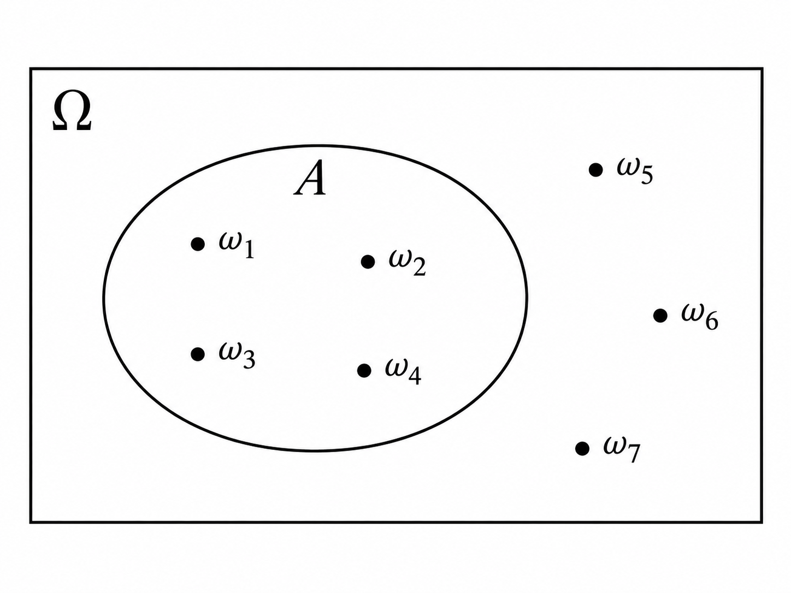

<!--

FONTES PRINCIPAIS PARA ESTA SEÇÃO

Spanos:
- Chapter 2 — Probability Theory: A Modeling Framework
- 2.1 Introduction
- 2.4 Random Experiments
- 2.5 Formalizing Condition [a]: The Outcomes Set
- 2.6 Formalizing Condition [b]: Events and Probabilities
- 2.7–2.8 Random Trials and Statistical Space (visão geral)

Bertsekas & Tsitsiklis:
- Chapter 1 — Sample Space and Probability
- 1.1 Sets
- 1.2 Probabilistic Models

Robert Ash:
- Chapter 1 — Basic Concepts
- Chapter 2 — Random Variables
- Exemplos de experimentos com múltiplos componentes e espaços amostrais formados por pares

Referências complementares consultadas:
- Berkeley Statistics — Measure Theory Basics
- David Aldous (Berkeley) — What is the significance of the Kolmogorov axioms?
- Penn State STAT 414 — Properties of Probability
- OpenStax — Sample spaces, outcomes and mutually exclusive events

-->

Antes de começarmos, vale dizer que este é o [**coração**]{.atencao} de muita coisa que faremos em Data Science, Machine Learning, Estatística e Inferência Causal.

::: {.callout-note appearance="simple"}

Nesta parte, começaremos um dos passos mais importantes da formação de alguém que trabalha com dados: **aprender a modelar**.

Até agora descrevemos a incerteza de maneira intuitiva. Agora começaremos a transformar essa descrição em uma estrutura matemática precisa.

Esse processo tem um nome fundamental: [**formalização**]{.conceito}.

:::

Vamos aprender a [**formalizar**]{.conceito} aquilo que muitas vezes nos é apresentado de maneira excessivamente informal.

Uma teoria não é simplesmente uma coleção de equações. **As equações aparecem depois.** Antes delas, precisamos definir quais são os objetos do problema, o que cada um significa, quais relações existem entre eles e quais premissas estamos assumindo.

É isso que transforma uma descrição intuitiva de um fenômeno em uma estrutura sobre a qual podemos raciocinar sistematicamente.

## O que exatamente vamos formalizar?

No capítulo anterior partimos de um **fenômeno estocástico**: existe incerteza sobre o resultado individual, mas podem surgir regularidades quando observamos o fenômeno repetidamente.

Para transformar essa ideia em Matemática, nossa formalização acontecerá em **duas grandes etapas**.

::: {.columns}

::: {.column width="48%"}

::: {.callout-note title="1 — Formalizar uma realização"}

Primeiro queremos representar matematicamente **um ensaio do experimento**:

- o que pode acontecer;
- sobre quais acontecimentos queremos falar;
- e como atribuímos probabilidades a eles.

É isso que faremos **neste capítulo**.

:::

:::

::: {.column width="48%"}

::: {.callout-note title="2 — Formalizar vários ensaios"}

Depois manteremos fixo o experimento básico e perguntaremos:

> **como representar probabilisticamente vários ensaios desse experimento em conjunto?**

Essa será uma nova etapa da formalização. Ainda estaremos construindo a estrutura probabilística; a conexão formal com uma **amostra** virá depois, quando introduzirmos variáveis aleatórias.

:::

:::

:::

Em resumo, nossa direção geral é:

$$
\boxed{\text{formalizar um ensaio}}
\qquad\longrightarrow\qquad
\boxed{\text{formalizar vários ensaios conjuntamente}}
$$

::: {.callout-important title="O que significa um ensaio?"}

Um **ensaio** é uma execução completa do experimento **tal como ele foi definido**.

Isso significa que a fronteira do experimento importa.

Se definirmos o experimento como “lançar uma moeda uma vez”, um ensaio termina depois de um lançamento.

Se definirmos o experimento como “lançar uma moeda duas vezes e registrar a ordem”, um ensaio termina somente depois dos dois lançamentos, e $(H,T)$ é **um único resultado desse ensaio**.

Neste capítulo, construiremos sempre o espaço de probabilidade correspondente a **um ensaio completo do experimento definido**.

:::

Neste capítulo, portanto, ficaremos **somente na primeira caixa**.

A pergunta que queremos responder é:

> **Onde vive a probabilidade de uma realização do experimento?**

Em muitos cursos mais aplicados, aprendemos rapidamente a calcular probabilidades, usar distribuições e aplicar fórmulas sem parar para construir com cuidado **a estrutura matemática dentro da qual essas probabilidades são definidas**.

É isso que faremos agora.

Para representar matematicamente **um ensaio**, construiremos uma estrutura em **três etapas**, sempre nessa ordem:

$$
\left.
\begin{array}{@{}l l c c@{}}
1. & \text{Quais resultados um ensaio do experimento pode produzir?}
& \quad\longrightarrow\quad & \Omega \\[0.35em]
2. & \text{Quais conjuntos desses resultados vamos admitir como eventos?}
& \quad\longrightarrow\quad & \mathcal{F} \\[0.35em]
3. & \text{Como atribuímos uma probabilidade a cada um desses eventos?}
& \quad\longrightarrow\quad & P
\end{array}
\right\}
\quad\Longrightarrow\quad
\boxed{(\Omega,\mathcal{F},P)}
$$

O objeto $(\Omega,\mathcal F,P)$ é chamado de [**Espaço de Probabilidade**]{.conceito} (*Probability Space*).

Essas serão exatamente as três partes deste capítulo:

1. **$\Omega$ — Espaço amostral:** quais resultados são possíveis?

2. **$\mathcal F$ — Família de eventos:** sobre quais conjuntos desses resultados queremos falar?

3. **$P$ — Lei de probabilidade:** como quantificamos a incerteza sobre esses eventos?

::: {.callout-important title="A ideia é construir, não decorar"}

Não vamos começar decorando $(\Omega,\mathcal F,P)$.

Vamos construir uma peça de cada vez. Quando chegarmos ao final, a notação terá surgido naturalmente porque cada objeto resolve uma pergunta diferente.

:::

Ao final deste capítulo teremos construído a estrutura básica para representar matematicamente **um ensaio completo do experimento**.

No próximo capítulo ainda permaneceremos nessa primeira etapa: veremos o que precisa ser ajustado quando o espaço amostral é contínuo.

Só depois passaremos à pergunta seguinte:

> **como representar probabilisticamente vários ensaios desse mesmo experimento em conjunto?**

## 1. Espaço amostral ($\Omega$)

::: {.callout-note title="Etapa 1 de 3"}

**Pergunta-guia:** quais resultados um ensaio do experimento pode produzir?

Nosso primeiro objetivo é construir $\Omega$.

:::

Antes de começar, vamos fixar uma notação que aparecerá o tempo todo. Usaremos a letra grega minúscula $\omega$ para representar **um resultado possível**. Quando o espaço amostral estiver definido, escreveremos

$$
\boxed{\omega\in\Omega}.
$$

Ainda vamos construir $\Omega$ com cuidado. Por enquanto, guarde apenas: $\omega$ é um resultado; $\Omega$ será o conjunto que reúne todos os resultados possíveis.

### O experimento

Para transformar um fenômeno incerto em um objeto matemático, precisamos primeiro dizer exatamente:

> **Qual é o procedimento completo cujo resultado queremos observar?**

Chamaremos esse procedimento de **experimento**.

Por exemplo:

> lançar um dado uma vez e observar a face superior.

Quando executamos esse procedimento uma vez, realizamos um **ensaio** (*trial*).

O ensaio termina quando o procedimento definido termina, e então observamos **um resultado** $\omega$.

Se a face observada for $4$, por exemplo, escrevemos $\omega=4$.

### A fronteira do experimento

Antes de construir o espaço amostral, existe uma decisão conceitual importante:

> **onde começa e onde termina um ensaio do experimento que queremos modelar?**

Essa fronteira determina o que precisa estar contido em um único resultado $\omega$.

Considere duas definições diferentes.

#### Exemplo: uma moeda, um lançamento

Defina o experimento como:

> lançar uma moeda uma vez e registrar a face.

Um ensaio termina depois desse lançamento e produz um resultado como $\omega=H$.

#### Exemplo: uma moeda, dois lançamentos dentro do mesmo experimento

Agora defina outro experimento:

> lançar uma moeda duas vezes e registrar, na ordem, as duas faces.

Um ensaio desse novo experimento só termina depois dos dois lançamentos e pode produzir, por exemplo, $\omega=(H,T)$.

Nos dois exemplos temos **um ensaio** e **um resultado**.

O que mudou foi a definição do experimento e, consequentemente, a quantidade de informação que um único resultado precisa carregar.

::: {.callout-important title="Um resultado pode ter várias coordenadas"}

A frase “um ensaio produz um resultado” não significa que esse resultado precise ser um único número ou uma única categoria.

Um resultado pode ser uma tupla como $(2,5)$, $(H,T)$ ou $(\text{compra},3.8\text{ s})$.

O que importa é que a tupla inteira descreva **o resultado completo de um ensaio do experimento que definimos**.

:::

[**Atenção à notação:** quando um resultado tiver várias coordenadas, neste curso preferiremos escrever explicitamente $\omega=(H,T)$. Em muitos livros você também encontrará a forma compacta $\omega=HT$. Nesse contexto, $HT$ é apenas uma abreviação para a mesma informação ordenada: primeira coordenada $H$, segunda coordenada $T$. Não significa multiplicação e, por si só, não significa que estamos modelando vários ensaios.]{.atencao}

### Os resultados possíveis

Antes de realizar um ensaio, não sabemos qual resultado particular $\omega$ será observado.

Mas precisamos especificar **quais valores $\omega$ pode assumir**.

Chamamos o conjunto de todos os resultados possíveis de um experimento de [**espaço amostral**]{.conceito} (*sample space*) e o representamos por $\Omega$.

Assim, cada possível resultado completo de um ensaio satisfaz

$$
\boxed{\omega\in\Omega}.
$$

Depois que o ensaio é realizado, um desses elementos de $\Omega$ é o resultado observado.

### Exemplo: um dado

Considere o experimento:

> lançar um dado de seis faces uma vez e observar a face superior.

Um ensaio produz uma única informação: o número observado.

Portanto,

$$
\Omega=\{1,2,3,4,5,6\}.
$$

Se observarmos $4$, então $\omega=4$ e, naturalmente, $4\in\Omega$.

Aqui o resultado possui apenas uma coordenada.

### Exemplo: dois dados

Agora considere um experimento diferente:

> lançar **dois dados distinguíveis uma vez** e registrar a face de cada dado.

Esse continua sendo **um único experimento**, e uma execução completa dele continua sendo **um único ensaio**.

Mas agora o resultado precisa guardar duas informações: a face do dado 1 e a face do dado 2.

Podemos escrever um resultado como $\omega=(\omega_{\text{dado 1}},\omega_{\text{dado 2}})$. Por exemplo, $\omega=(2,5)$.

Cada coordenada possui seu próprio conjunto de possibilidades: $\Omega_{\text{dado 1}}=\{1,2,3,4,5,6\}$ e $\Omega_{\text{dado 2}}=\{1,2,3,4,5,6\}$.

Para construir o conjunto de todos os resultados completos possíveis, combinamos as possibilidades das duas coordenadas. É aqui que aparece o [**produto cartesiano**]{.conceito}.

Dados dois conjuntos $A$ e $B$, o produto cartesiano $A\times B$ é o conjunto de todos os pares ordenados $(a,b)$ com $a\in A$ e $b\in B$.

No experimento dos dois dados:

$$
\boxed{
\Omega
=
\Omega_{\text{dado 1}}
\times
\Omega_{\text{dado 2}}
}
$$

ou, explicitamente, $\Omega=\{1,2,3,4,5,6\}\times\{1,2,3,4,5,6\}$.

Cada elemento de $\Omega$ é **um resultado completo de um único ensaio**, como $(2,5)$, $(6,1)$ ou $(3,3)$. Como existem seis possibilidades para cada coordenada, $|\Omega|=6\times6=36$.

::: {.callout-important title="Aqui não estamos repetindo o experimento"}

No resultado $\omega=(2,5)$, a primeira coordenada descreve o **dado 1** e a segunda descreve o **dado 2**.

Elas são duas coordenadas **dentro do mesmo resultado** de **um único ensaio**.

Mais adiante aparecerá uma tupla visualmente parecida, $(\omega_1,\ldots,\omega_n)$, em que cada coordenada representará o resultado de **um ensaio diferente** de um experimento básico.

A ferramenta matemática será novamente um produto cartesiano, mas a interpretação será outra.

$$
\boxed{
\text{várias coordenadas de um resultado}
\;\neq\;
\text{vários ensaios}
}
$$

:::

### O produto cartesiano é uma ferramenta, não uma interpretação

O produto cartesiano resolve uma necessidade matemática geral:

> **construir objetos com várias coordenadas.**

A razão pela qual existem várias coordenadas depende do experimento que definimos.

No exemplo dos dois dados, $\omega=(\omega_{\text{dado 1}},\omega_{\text{dado 2}})$ tem duas coordenadas porque queremos registrar duas partes do resultado de **um mesmo ensaio**.

Também poderíamos selecionar uma pessoa e registrar altura e peso. Um resultado teria a forma $\omega=(\text{altura},\text{peso})$.

Ou poderíamos definir como experimento “lançar uma moeda três vezes e registrar a sequência”. Nesse caso, um único ensaio poderia produzir $\omega=(H,T,H)$, e o espaço amostral seria $\{H,T\}^3$.

O produto cartesiano, portanto, não significa “repetição”. Ele apenas nos fornece uma maneira de organizar **componentes de um objeto**.

::: {.callout-note title="A mesma ferramenta aparecerá novamente"}

Quando mais adiante fixarmos um experimento básico e quisermos representar **vários ensaios conjuntamente**, o produto cartesiano aparecerá outra vez.

A diferença será conceitual:

- aqui, as coordenadas pertencem ao **resultado de um único ensaio**;
- lá, cada coordenada corresponderá ao **resultado de um ensaio diferente**.

:::

### Espaços amostrais podem ter tamanhos diferentes

Até aqui usamos exemplos com poucos resultados possíveis, mas $\Omega$ não precisa ser finito.

Na verdade, existem três situações importantes.

#### 1. Espaço amostral finito

Um espaço amostral é **finito** quando possui um número limitado de resultados possíveis.

Por exemplo, ao lançar um dado de seis faces:

$$
\Omega=\{1,2,3,4,5,6\}.
$$

Podemos literalmente listar todos os resultados possíveis e terminar a lista.

O mesmo acontece com uma moeda:

$$
\Omega=\{H,T\}.
$$

---

#### 2. Espaço amostral infinito enumerável

Agora imagine que queremos registrar:

> **quantas chamadas chegam a um sistema durante determinado período?**

Os resultados possíveis são:

$$
\Omega=\{0,1,2,3,\ldots\}.
$$

Não existe um último número possível nessa lista.

Portanto, $\Omega$ possui **infinitos elementos**.

Mas existe algo importante: ainda conseguimos imaginar os resultados sendo listados, um depois do outro:

$$
0,1,2,3,4,\ldots
$$

Por isso dizemos que esse conjunto é **infinito enumerável** (*countably infinite*).

Outro exemplo seria o número de tentativas até um usuário conseguir concluir determinado processo:

$$
1,2,3,4,\ldots
$$

Novamente, existem infinitas possibilidades, mas elas podem ser organizadas em uma sequência.

---

#### 3. Espaço amostral infinito não enumerável

Agora considere outra pergunta:

> **quanto tempo um usuário leva para concluir o checkout?**

Poderíamos representar os resultados possíveis por

$$
\Omega=[0,\infty).
$$

Mas o que significa esse intervalo?

Ele contém não apenas $1$, $2$, $3$, etc., mas qualquer valor intermediário possível:

$$
1.2,\;1.23,\;1.234,\;1.2345,\ldots
$$

E isso não acontece apenas entre $1$ e $2$.

Entre **quaisquer dois valores diferentes**, por mais próximos que estejam, existem infinitos outros valores.

Por exemplo, entre $1.2$ e $1.3$ temos

$$
1.21,\;1.211,\;1.212,\;1.25,\ldots
$$

Não existe um "próximo número" depois de $1.2$ da mesma forma que existe um próximo inteiro depois de $1$.

Por isso não conseguimos listar esses resultados um a um como fizemos com

$$
\{0,1,2,3,\ldots\}.
$$

Chamamos esse tipo de conjunto de **infinito não enumerável** (*uncountably infinite*).

---

Portanto, podemos ter:

- **finito:** $\Omega=\{H,T\}$;
- **infinito enumerável:** $\Omega=\{0,1,2,3,\ldots\}$;
- **infinito não enumerável:** $\Omega=[0,\infty)$.

::: {.callout-important title="Infinito não é tudo a mesma coisa"}

Os conjuntos

$$
\{0,1,2,3,\ldots\}
$$

e

$$
[0,\infty)
$$

possuem ambos infinitos elementos.

Mas são infinitos de naturezas diferentes.

No primeiro, conseguimos conceitualmente **enumerar** os resultados:

$$
0,1,2,3,\ldots
$$

No segundo, isso não é possível: dentro de qualquer pequeno intervalo continuam existindo infinitas possibilidades.

Essa diferença parecerá muito menos abstrata quando começarmos a trabalhar com variáveis **discretas** e **contínuas**.

:::

::: {.callout-tip title="Onde isso vai aparecer na prática?"}

Essa distinção está por trás de algo que usamos o tempo inteiro em Data Science.

Considere três coisas que poderíamos registrar:

- **forma de pagamento:** cartão, Pix ou boleto;
- **número de compras de um cliente:** $0,1,2,3,\ldots$;
- **tempo até concluir uma compra:** $2.31$, $2.314$, $2.3147,\ldots$ segundos.

Esses objetos têm naturezas diferentes.

A forma de pagamento assume **categorias**.

O número de compras assume valores que podemos **contar**.

O tempo pode, pelo menos matematicamente, assumir qualquer valor dentro de um **intervalo**.

Mais adiante, quando introduzirmos variáveis aleatórias, veremos que essa diferença ajuda a entender de onde vêm ideias como **variáveis categóricas, discretas e contínuas** — e por que não usamos exatamente as mesmas ferramentas probabilísticas para todas elas.

:::

Por enquanto, não precisamos desenvolver nenhuma teoria adicional.

A ideia importante é apenas perceber que o conjunto de resultados possíveis pode ter estruturas muito diferentes — e que essa estrutura terá consequências para a forma como representaremos probabilidades mais adiante.

### O espaço amostral precisa ser completo e sem ambiguidade

Se $\Omega$ pretende representar os resultados possíveis de um ensaio, queremos duas coisas muito simples:

- [**coletivamente exaustivos**]{.conceito}: não importa o que aconteça no experimento, **algum resultado de $\Omega$ precisa acontecer**. Não podemos esquecer nenhuma possibilidade;
- [**mutuamente exclusivos**]{.conceito}: se um resultado aconteceu, **nenhum outro resultado elementar pode ter acontecido ao mesmo tempo**.

Juntas, essas duas ideias dizem algo ainda mais simples:

> **ao final de um ensaio, devemos conseguir apontar para exatamente um $\omega\in\Omega$ e dizer: “foi isso que aconteceu”.**

#### Um exemplo simples

Considere o experimento:

> lançar uma moeda duas vezes e registrar a ordem dos resultados.

Então,

$$
\Omega=\{(H,H),(H,T),(T,H),(T,T)\}.
$$

Esse espaço é **coletivamente exaustivo** porque qualquer sequência possível de dois lançamentos aparece na lista.

E seus resultados são **mutuamente exclusivos** porque, em um mesmo ensaio, não podemos observar simultaneamente $(H,T)$ e $(T,H)$: ou o primeiro lançamento foi $H$ e o segundo $T$, ou ocorreu o contrário.

Isso também mostra por que $(H,T)$ e $(T,H)$ precisam aparecer como resultados diferentes: **o resultado elementar deve descrever completamente aquilo que decidimos observar**.

Se retirássemos $(T,H)$, teríamos esquecido uma possibilidade e o espaço deixaria de ser exaustivo.

Essas duas propriedades dizem **quando um espaço amostral está bem definido**.

Mas ainda falta uma pergunta importante:

> **quanto detalhe devemos colocar em cada resultado?**

### O espaço amostral depende da pergunta

O espaço amostral não vem pronto da realidade. Ele depende do que decidimos preservar no modelo.

Considere o experimento mais simples possível: lançar uma moeda uma vez.

Se queremos registrar apenas a face observada, basta

$$
\Omega_1=\{H,T\}.
$$

Esse espaço já é mutuamente exclusivo e coletivamente exaustivo.

Mas imagine que, por algum motivo, acreditamos que o **clima** também seja relevante para o fenômeno. Podemos construir um modelo mais detalhado:

$$
\Omega_2=
\{
(H,\text{chove}),
(H,\text{não chove}),
(T,\text{chove}),
(T,\text{não chove})
\}.
$$

Esse espaço também pode ser construído de forma mutuamente exclusiva e coletivamente exaustiva.

Então qual dos dois está “certo”?

Os dois podem estar.

A diferença é **o que escolhemos guardar no modelo**.

Se o clima não tem qualquer papel na pergunta que queremos responder, incluí-lo apenas adiciona detalhe desnecessário. Se acreditamos que ele pode importar, talvez precisemos preservá-lo.

::: {.callout-important title="Formalizar não é apenas escrever símbolos"}

O mundo real contém uma quantidade enorme de detalhes.

Ao construir um modelo, precisamos decidir **quais detalhes manter e quais ignorar**.

Essa escolha exige contexto, julgamento e conhecimento do problema:

> **formalizar é também uma decisão de modelagem.**

:::

#### Trazendo para um problema real: checkout

Considere agora um usuário chegando ao checkout de um e-commerce.

Se nossa pergunta for apenas

> **o usuário realizará uma compra?**

podemos trabalhar com

$$
\Omega=\{\text{compra},\text{não compra}\}.
$$

Se também quisermos registrar **como** a compra foi feita, precisaremos preservar mais informação:

$$
\Omega=
\{
(\text{compra},\text{cartão}),
(\text{compra},\text{Pix}),
(\text{compra},\text{boleto}),
(\text{não compra})
\}.
$$

A situação real não mudou. Mudou **a pergunta que queremos responder** e, com ela, a resolução do nosso modelo.

O princípio é:

> **os resultados precisam ser mutuamente exclusivos, coletivamente exaustivos e detalhados o suficiente para responder à pergunta que queremos fazer — sem preservar informação que não precisamos.**

### Fechando a primeira peça

Construímos a primeira parte do Espaço de Probabilidade:

$$
\boxed{\Omega}
$$

Agora sabemos representar **todos os resultados que um ensaio do experimento pode produzir**.

E vimos também que um resultado $\omega$ não precisa carregar apenas uma informação: quando o experimento exige várias, podemos construir espaços mais ricos usando estruturas como o **produto cartesiano**.

Mas ainda não atribuímos nenhuma probabilidade.

Antes disso, precisamos decidir quais **conjuntos de resultados** queremos tratar como objetos probabilísticos.

É daí que nasce a segunda peça: $\mathcal F$.

## 2. Família de eventos ($\mathcal F$)

::: {.callout-note title="Etapa 2 de 3"}

**Pergunta-guia:** sobre quais acontecimentos do experimento queremos ser capazes de atribuir probabilidades?

Já construímos $\Omega$, o conjunto de todos os resultados possíveis.

Agora precisamos construir os objetos aos quais, na próxima etapa, atribuiremos probabilidades.

Esses objetos são os **eventos**.

:::

### Eventos: transformando perguntas reais em conjuntos

Quando realizamos um ensaio, observamos **um único resultado** $\omega\in\Omega$.

Mas normalmente queremos fazer perguntas mais amplas do que “qual resultado específico ocorreu?”.

Considere novamente um único ensaio do experimento com duas moedas distinguíveis A e B. Como definimos como **um único ensaio**, sabemos que um possível elemento é o $w = (H, T)$. 

Isso nos leva a definir o espaço amostral garantindo as suas duas propriedades (mutuamente exclusivo e coletivamente exaustivo). Temos, então:

$$
\Omega=\{(H,H),(H,T),(T,H),(T,T)\}.
$$

Podemos perguntar, por exemplo:

> **Saiu exatamente uma cara?**

Essa afirmação é verdadeira para dois resultados possíveis: $(H,T)$ e $(T,H)$.

Reunimos então esses resultados no conjunto

$$
A=\{(H,T),(T,H)\}.
$$

Esse conjunto é um [**evento**]{.conceito}: um subconjunto de $\Omega$ que representa uma pergunta ou afirmação sobre o resultado do experimento.

$$
\boxed{
\text{pergunta sobre o experimento}
\longrightarrow
\text{evento }A\subseteq\Omega
}
$$

{.course-figure width="50%"}

Quando realizamos o ensaio e observamos $\omega$, dizemos que o evento $A$ ocorreu exatamente quando $\omega\in A$.

Por exemplo, se observamos $\omega=(H,T)$, então $\omega\in A$ e a resposta para “saiu exatamente uma cara?” é sim.

[**Lembrete de notação:** manteremos os pares explícitos, como $(H,T)$, porque eles deixam visível qual informação pertence a cada coordenada. Se alguma fonte escrever $HT$, leia essa forma apenas como uma abreviação de $(H,T)$ neste tipo de experimento.]{.atencao}

::: {.callout-important title="Resultado e evento não são a mesma coisa"}

O **resultado** é um único elemento $\omega\in\Omega$ observado em um ensaio.

O **evento** é um conjunto de resultados, isto é, $A\subseteq\Omega$.

Assim, observar $\omega=(H,T)$ não significa que $(H,T)$ e $(T,H)$ ocorreram ao mesmo tempo. Significa que o único resultado observado, $(H,T)$, pertence ao evento

$A=\{(H,T),(T,H)\}$.

Dizer que **$A$ ocorreu** significa simplesmente que $\omega\in A$.

:::

### Combinando perguntas

Como eventos são conjuntos, operações entre conjuntos nos permitem combinar perguntas sobre o mesmo ensaio.

Defina

$A=$ “a moeda A mostra cara” e  
$B=$ “a moeda B mostra cara”.

Então:

- $A\cap B$: **A e B ocorrem**;
- $A\cup B$: **A ou B ocorre**;
- $A^c$: **A não ocorre**.

É por isso que a Teoria dos Conjuntos aparece aqui: ela fornece uma linguagem precisa para combinar afirmações sobre o resultado do experimento.

Um único resultado pode fazer **vários eventos** ocorrerem.

Se $\omega=(H,H)$, por exemplo, então $\omega\in A$ e $\omega\in B$. Portanto, os dois eventos ocorreram.

Isso não contradiz a exclusividade dos resultados elementares: houve apenas **um resultado**, $(H,H)$, mas esse mesmo resultado pode pertencer a vários conjuntos-eventos.

### Dois eventos especiais

A própria estrutura dos conjuntos nos fornece dois eventos que aparecerão o tempo todo.

Considere um dado comum, com $\Omega=\{1,2,3,4,5,6\}$.

#### Evento certo: $\Omega$

Pergunte:

> **O resultado foi algum número entre 1 e 6?**

Qualquer possível resultado do experimento torna essa afirmação verdadeira. O evento correspondente é o próprio $\Omega$.

Por isso ele é chamado de [**evento certo**]{.conceito} (*certain event*). Mais adiante teremos $P(\Omega)=1$.

#### Evento impossível: $\varnothing$

Agora pergunte:

> **O resultado do dado foi 7?**

Nenhum elemento de $\Omega$ satisfaz essa afirmação. O conjunto de resultados que a tornariam verdadeira não contém elemento algum:

$$
\varnothing.
$$

Por isso $\varnothing$ é o [**evento impossível**]{.conceito} (*impossible event*). Mais adiante teremos $P(\varnothing)=0$.

Esses exemplos podem parecer óbvios, mas mostram a lógica dos eventos com clareza: **uma pergunta é representada pelo conjunto de todos os resultados que fariam a resposta ser “sim”.**

### De eventos para uma família de eventos

Agora temos vários eventos — $A$, $B$, $A^c$, $A\cup B$, etc.

Como queremos atribuir probabilidades a eles, precisamos reuni-los em uma **coleção**.

Na matemática, uma coleção de conjuntos é frequentemente chamada de uma [**família**]{.conceito} de conjuntos.

Chamaremos nossa família de eventos de $\mathcal F$.

Assim:

- $\omega\in\Omega$: um **resultado possível** é um elemento do espaço amostral;
- $A\subseteq\Omega$: um **evento** é um subconjunto do espaço amostral;
- $A\in\mathcal F$: $A$ pertence à **família de eventos** considerada, ou seja, é um elemento de $\mathcal F$ (e **não** um subconjunto!).

Mas existe uma exigência natural.

Até aqui chamamos $\mathcal F$ de nossa **família de eventos**. Podemos agora dar um nome um pouco mais formal a essa coleção: ela será o nosso [**espaço de eventos**]{.conceito}.

A ideia é que esse espaço não contenha apenas os eventos que nos interessam originalmente, como $A$ e $B$.

Se conseguimos perguntar:

- **"$A$ ocorreu?"**
- **"$B$ ocorreu?"**

também queremos conseguir perguntar:

- **"$A$ não ocorreu?"**
- **"$A$ ou $B$ ocorreu?"**
- **"$A$ e $B$ ocorreram?"**

Essas novas perguntas correspondem aos eventos $A^c$, $A\cup B$ e $A\cap B$.

Por isso, queremos que, ao combinar eventos que já pertencem a $\mathcal F$, os novos eventos produzidos **continuem pertencendo a $\mathcal F$**.

Na matemática, dizemos que uma coleção é [**fechada sob uma operação**]{.conceito} quando aplicamos essa operação aos seus elementos e o resultado continua dentro da própria coleção.

Por exemplo:

- os números inteiros são **fechados sob adição**, porque a soma de dois inteiros continua sendo um inteiro;
- mas **não são fechados sob divisão**, porque, por exemplo, $1/2$ não é inteiro.

No nosso caso, queremos que o espaço de eventos seja **fechado sob operações de conjuntos**.

Assim:

- se $A\in\mathcal F$, então queremos também $A^c\in\mathcal F$;
- se $A,B\in\mathcal F$, então queremos $A\cup B\in\mathcal F$;
- e também $A\cap B\in\mathcal F$.

Ou seja,

> **o espaço de eventos é uma coleção de subconjuntos de $\Omega$ que permanece estável quando aplicamos a ela as operações de conjuntos que precisamos usar.**

Isso é justamente o que significa dizer que, nesse caso, $\mathcal F$ é **fechado sob complemento, união e interseção** (ou como apresentamos inicialmente, **fechado sob operações de conjuntos**).

::: {.callout-note title="No caso finito, a ideia é simples"}

Lembra da época da escola quando aprendemos sobre o **conjunto das partes**?

Considere, por exemplo, o conjunto $S=\{1,2\}$.

Podemos formar os seguintes subconjuntos de $S$:

$$
\varnothing,\qquad
\{1\},\qquad
\{2\},\qquad
\{1,2\}.
$$

A coleção formada por **todos os subconjuntos de $S$** é chamada de **conjunto das partes** (*power set*) e pode ser representada por $2^S$:

$$
2^S=
\{
\varnothing,
\{1\},
\{2\},
\{1,2\}
\}.
$$

Agora estamos usando exatamente a mesma ideia em Probabilidade. Para um único lançamento de moeda, $\Omega=\{H,T\}$. Todos os subconjuntos de $\Omega$ são:

$$
\mathcal F=
\{
\varnothing,
\{H\},
\{T\},
\Omega
\}.
$$

Só que agora cada um desses subconjuntos tem uma interpretação como **evento**:

- $\{H\}$: saiu cara;
- $\{T\}$: saiu coroa;
- $\Omega$: saiu cara ou coroa — o **evento certo**;
- $\varnothing$: ocorreu algo impossível — o **evento impossível**.

Ou seja, nesse caso estamos simplesmente tomando como nossa família de eventos **todos os subconjuntos de $\Omega$**: $\mathcal F=2^\Omega$.

E agora chegamos exatamente onde queríamos. Temos uma coleção com todos os eventos sobre os quais queremos ser capazes de perguntar:

> **Qual é a probabilidade de sair cara?**

> **Qual é a probabilidade de sair coroa?**

> **Qual é a probabilidade do evento certo?**

> **E do evento impossível?**

Os eventos já estão definidos e organizados em $\mathcal F$.

**_E agora?_**

Agora falta uma regra que pegue cada evento dessa família e diga **quão provável ele é**.

Essa será nossa terceira peça: $P$.

Mais adiante, escreveremos essa ideia como

$$
\mathcal F
\;\xrightarrow{\quad P\quad}\;
[0,1].
$$

Em espaços finitos pequenos, frequentemente podemos trabalhar dessa forma e simplesmente tomar o **conjunto das partes** como nosso espaço de eventos: $\mathcal F=2^\Omega$.

Mas existe uma primeira sutileza importante: o conjunto das partes cresce **muito rapidamente**.

Se $\Omega$ possui $N$ resultados possíveis, então $2^\Omega$ possui

$$
2^N
$$

subconjuntos — isto é, $2^N$ eventos possíveis.

Com uma única moeda, temos apenas $2$ resultados e, portanto, $2^2=4$ subconjuntos. Nada demais.

Mas, se lançarmos uma moeda três vezes e registrarmos a sequência, teremos $8$ resultados possíveis. O conjunto das partes já terá $2^8=256$ eventos.

Ou seja:

> **não precisamos necessariamente colocar em $\mathcal F$ todos os eventos matematicamente possíveis se apenas alguns deles são relevantes para o problema que queremos modelar.**

Essa é uma primeira razão, bastante prática, para distinguir **espaço de eventos** de **conjunto das partes**.

E a situação cresce ainda mais rápido quando $\Omega$ é infinito.

Por exemplo, considere um espaço enumerável como $\Omega=\{0,1,2,3,\ldots\}$.

Os elementos de $\Omega$ podem ser listados um a um. Porém, seu conjunto das partes $2^\Omega$ já é **não enumerável**: existem tantos subconjuntos de $\Omega$ quanto números reais.

Ou seja, algo interessante aconteceu:

$$
\boxed{\Omega\text{ é enumerável}}
\qquad\text{mas}\qquad
\boxed{2^\Omega\text{ não é enumerável}.}
$$

Isso mostra como o conjunto das partes pode se tornar enorme mesmo quando o próprio espaço amostral ainda parece relativamente simples.

E existe ainda uma segunda sutileza, agora **matemática**.

Quando $\Omega$ é não enumerável, como acontece ao modelarmos uma quantidade contínua, por exemplo o tempo necessário para concluir um checkout, nem sempre podemos tratar **todos** os elementos de $2^\Omega$ como eventos aos quais uma probabilidade pode ser atribuída de maneira consistente.

Não precisamos entender essa dificuldade ainda.

Por enquanto, guarde apenas:

> **$\mathcal F$ é o nosso espaço de eventos e não precisa ser igual ao conjunto das partes $2^\Omega$.**

Nos casos finitos mais simples, muitas vezes usamos $\mathcal F=2^\Omega$ porque isso é conveniente.

Mais adiante veremos por que, em espaços infinitos e principalmente contínuos, precisamos escolher $\mathcal F$ com um pouco mais de cuidado.

:::

### Fechando a segunda peça

Já construímos duas partes do espaço de probabilidade:

$$
\boxed{\Omega}
\qquad\longrightarrow\qquad
\boxed{\mathcal F}.
$$

$\Omega$ reúne os **resultados possíveis**.

$\mathcal F$ reúne (todos os possíveis) **eventos sobre os quais queremos atribuir probabilidades**.

Agora podemos [**finalmente**]{.atencao} perguntar:

> **Quão provável é cada evento?**

Essa é a função da terceira peça: $P$.

## 3. Lei de probabilidade ($P$)

::: {.callout-note title="Etapa 3 de 3"}

**Pergunta-guia:** como atribuímos uma probabilidade a cada evento de $\mathcal F$?

Já construímos:

- $\Omega$: os resultados que podem ocorrer;
- $\mathcal F$: os eventos sobre os quais queremos fazer perguntas probabilísticas.

Agora construiremos a terceira e última peça do Espaço de Probabilidade: $P$.

:::

### Antes: o que é mesmo uma função?

Vale relembrar rapidamente uma ideia básica.

Uma **função** é uma regra que associa a cada elemento de um conjunto exatamente um elemento de outro conjunto.

Por exemplo, considere

$$
f:\{1,2,3\}\longrightarrow\mathbb R,
\qquad
f(x)=x^2.
$$

A função pega cada elemento do domínio e associa a ele uma imagem:

$$
1 \xrightarrow{\;f\;} 1,
\qquad
2 \xrightarrow{\;f\;} 4,
\qquad
3 \xrightarrow{\;f\;} 9.
$$

Assim:

- **domínio:** $\{1,2,3\}$ — os elementos que podem entrar na função;
- **contradomínio:** $\mathbb R$ — o conjunto no qual as saídas devem estar;
- **imagem da função:** $\{1,4,9\}$ — os valores que efetivamente aparecem como saída.

De forma geral, para um elemento $x$ do domínio, podemos representar a ação da função assim:

$$
x
\quad\xrightarrow{\;f\;}\quad
f(x).
$$

Guarde essa imagem, porque é exatamente a mesma estrutura que usaremos agora.

### Uma função cujas entradas são conjuntos

A lei de probabilidade será uma função

$$
P:\mathcal F\longrightarrow[0,1].
$$

::: {.callout-important title="O que entra dentro de $P(\cdot)$?"}

Até este ponto do curso, a resposta é simples:

> **eventos.**

Formalmente, escrevemos $P(A)$ porque $A\in\mathcal F$, e cada $A$ é um **conjunto de resultados possíveis**.

Mais adiante aparecerão notações que visualmente parecem colocar outros objetos dentro de $P(\cdot)$. Quando chegarmos lá, veremos que por trás delas continua existindo um evento. Por enquanto, mantenha a regra:

$$
\boxed{A\in\mathcal F\quad\longmapsto\quad P(A)}.
$$

:::

Compare com o que acabamos de ver:

$$
x
\quad\xrightarrow{\;f\;}\quad
f(x)
$$

e agora:

$$
A
\quad\xrightarrow{\;P\;}\quad
P(A).
$$

A lógica é a mesma.

A diferença importante está no **tipo de objeto que entra na função**.

Na função $f$, entrava um elemento $x$.

Na função $P$, entra um **evento** $A\in\mathcal F$ (e eventos são conjuntos).

A função $P$ associa então a esse evento um número entre $0$ e $1$ (mais a frente falamos sobre isso):

$$
A
\quad\xrightarrow{\;P\;}\quad
P(A)\in[0,1].
$$

Esse número $P(A)$ representa a **probabilidade de o evento $A$ ocorrer**.

Por exemplo, no lançamento de uma moeda justa:

$$
\Omega=\{H,T\}
$$

e

$$
\mathcal F=\{\varnothing,\{H\},\{T\},\Omega\}
$$

Pensamos em alguma regras de associação e podemos definir a função $P$ por:

$$
\begin{aligned}
P(\varnothing)&=0,\\
P(\{H\})&=0.5,\\
P(\{T\})&=0.5,\\
P(\Omega)&=1.
\end{aligned}
$$

Podemos visualizar um elemento sendo associado, por exemplo:

$$
\{H\}
\quad\xrightarrow{\;P\;}\quad
0.5.
$$

Ou seja, a imagem do evento $\{H\}$ pela função $P$ é $0.5$.

Nesse exemplo:

- **domínio:** $\mathcal F$, a família de eventos;
- **contradomínio:** $[0,1]$;
- **imagem da função:** $\{0,0.5,1\}$.

::: {.callout-important title="Uma diferença que normalmente passa batido"}

Formalmente, $P$ atribui probabilidades a **eventos**, isto é, a conjuntos.

Por isso escrevemos

$P(A)$, com $A\in\mathcal F$.

Em modelos discretos, como no caso de lançar uma moeda, é comum escrever informalmente algo como $P(H)$.

Mas, rigorosamente, estamos nos referindo ao evento formado apenas pelo resultado $H$:

$$
P(\{H\})
$$

:::

### Por que pensar em probabilidade como uma "medida"?

Até aqui chegamos a uma função $P:\mathcal F\to[0,1]$ que atribui números a eventos.

Mas por que a matemática moderna decidiu tratar probabilidade justamente como uma **medida**?

A motivação fica mais clara se pensarmos no problema que precisava ser resolvido.

Em situações finitas, podemos imaginar que cada resultado recebe uma parcela de probabilidade e que a probabilidade de um evento é obtida somando essas parcelas.

Mas essa intuição começa a ficar insuficiente quando o espaço amostral é infinito — especialmente quando é contínuo.

Em um intervalo contínuo existem incontáveis pontos. Podemos ter cada ponto individual com probabilidade zero e, ainda assim, um intervalo inteiro com probabilidade positiva.

Então a pergunta deixa de ser apenas

> **quanto vale a probabilidade de cada ponto?**

 e passa a ser

> **como atribuir, de maneira consistente, um tamanho a conjuntos inteiros de resultados?**

Essa pergunta já havia aparecido em outra área da Matemática.

Matemáticos que estudavam comprimento, área e volume também precisavam responder:

> **como atribuir um tamanho consistente a conjuntos, inclusive quando eles envolvem infinitos pontos e operações de limite?**

Foi para problemas desse tipo que a **Teoria da Medida** se desenvolveu no fim do século XIX e início do século XX, com ideias associadas, entre outros, a Borel e Lebesgue.

A grande sacada para a Probabilidade foi perceber que a estrutura necessária era praticamente a mesma.

Em vez de medir **comprimento** ou **área** de conjuntos, poderíamos medir o seu **tamanho probabilístico**.

Essa conexão foi consolidada na axiomatização moderna da Probabilidade em 1933: uma probabilidade pode ser tratada matematicamente como um caso especial de medida, com uma escala específica em que o espaço inteiro possui medida $1$.

::: {.callout-note title="A dor matemática que a ideia de medida resolve"}

Queremos uma regra para medir conjuntos que continue coerente mesmo quando saímos de exemplos finitos simples e entramos em espaços infinitos e contínuos.

A estrutura de medida nos dá exatamente isso:

- tamanhos não negativos;
- adição coerente para conjuntos que não se sobrepõem;
- uma extensão coerente quando passamos de um número finito para uma sequência infinita de conjuntos;
- no caso da Probabilidade, tamanho total normalizado para $1$.

:::

Em Probabilidade, os conjuntos que medimos são os **eventos**.

Assim, $P(A)$ pode ser interpretado como o tamanho probabilístico do conjunto $A$: quanto da massa probabilística total está associado àquele evento.

Podemos imaginar uma massa total igual a $1$ distribuída sobre $\Omega$. Então $P(\Omega)=1$, enquanto $P(A)$ mede quanto dessa massa está associado a $A$.

Para uma moeda justa, por exemplo, $P(\{H\})=0.5$ e $P(\{T\})=0.5$.

A ideia central é:

$$
\boxed{
\text{probabilidade}
=
\text{uma medida sobre eventos, com }P(\Omega)=1
}
$$

Isso explica por que a linguagem de conjuntos que construímos antes não era um detalhe formal desnecessário.

Quando chegamos a espaços contínuos, nem sempre faz sentido tentar construir a teoria atribuindo probabilidades ponto a ponto. A estrutura correta é atribuir uma medida a **eventos**, isto é, a conjuntos adequados de resultados.

### Mas qualquer função serve?

Não.

Agora sabemos que queremos mais do que uma função qualquer

$$
P:\mathcal F\longrightarrow[0,1].
$$

Queremos que os números atribuídos aos eventos sejam **coerentes entre si**.

Por exemplo, se alguém propusesse $P(\Omega)=0.4$, o valor estaria dentro de $[0,1]$, mas não faria sentido probabilisticamente: $\Omega$ representa **tudo o que pode acontecer**.

Então precisamos estabelecer algumas regras.

Para enxergar de onde elas vêm, vamos começar pelo caso mais simples — **um número finito de eventos** — e só depois veremos a sutileza que aparece quando há infinitos.

### Primeiro: três regras muito naturais

#### 1. Não-negatividade

Para qualquer evento $A\in\mathcal F$,

$$
\boxed{P(A)\geq0}.
$$

Probabilidade representa um tamanho. Portanto, não pode ser negativa.

#### 2. Normalização

Como $\Omega$ reúne **tudo o que pode acontecer**,

$$
\boxed{P(\Omega)=1}.
$$

Temos $100\%$ de probabilidade de que o resultado do ensaio pertença ao espaço amostral que definimos.

#### 3. Aditividade — por enquanto, para dois eventos

Se $A$ e $B$ são mutuamente exclusivos, isto é, $A\cap B=\varnothing$, então

$$
\boxed{
P(A\cup B)=P(A)+P(B)
}.
$$

A intuição é a mesma de uma medida: se duas partes não se sobrepõem, o tamanho do conjunto formado pelas duas é a soma dos tamanhos de cada parte.

::: {.callout-important title="Por que não pode haver sobreposição?"}

Se $A$ e $B$ tiverem resultados em comum, somar $P(A)+P(B)$ contaria essa parte compartilhada duas vezes.

Quando $A\cap B=\varnothing$, isso não acontece.

:::

Até aqui, essas três regras já nos permitem trabalhar perfeitamente com qualquer **quantidade finita** de eventos disjuntos.

Por exemplo, para três eventos disjuntos,

$$
P(A\cup B\cup C)
=
P(A)+P(B)+P(C),
$$

porque podemos aplicar a regra duas vezes.

O mesmo raciocínio funciona para $10$, $100$ ou qualquer número **finito** de eventos.

Assim, se

$$
A=\{\omega_1,\omega_2,\ldots,\omega_k\},
$$

podemos escrever

$$
A
=
\{\omega_1\}\cup\{\omega_2\}\cup\cdots\cup\{\omega_k\}
$$

e concluir que

$$
P(A)
=
\sum_{i=1}^{k}P(\{\omega_i\}).
$$

No caso finito, portanto, a ideia de distribuir massa entre os resultados individuais e depois somar funciona naturalmente.

### Mas o infinito cria uma sutileza nova

Agora considere outro experimento:

> lançar uma moeda repetidamente até aparecer a primeira cara.

Um resultado possível é $1$: a primeira cara apareceu imediatamente.

Outro é $2$: primeiro veio coroa e depois cara.

E assim por diante:

$$
\Omega=\{1,2,3,\ldots\}.
$$

Suponha que a lei de probabilidade nos diga que

$$
P(\{n\})=\frac{1}{2^n}.
$$

Não precisamos derivar essa fórmula agora. O ponto é outro.

Considere o evento

$$
A=\{2,4,6,\ldots\},
$$

isto é, “a primeira cara apareceu em um número par de lançamentos”.

Intuitivamente, gostaríamos de escrever

$$
P(A)
=
P(\{2\})+P(\{4\})+P(\{6\})+\cdots.
$$

Mas repare no salto que acabamos de fazer.

A regra anterior nos autorizava a somar **dois eventos** e, repetindo o argumento, qualquer quantidade **finita** deles.

Agora estamos tentando somar uma quantidade **infinita** de eventos.

Aplicar uma regra finita muitas vezes continua sendo apenas aplicá-la um número finito de vezes. Isso, sozinho, não justifica passar para

$$
P(A)
=
\frac14+\frac1{16}+\frac1{64}+\cdots.
$$

Precisamos de uma regra adicional — ou, mais precisamente, de uma versão **mais forte** da aditividade.

### Por que aparece uma sequência $A_1,A_2,A_3,\ldots$?

Aqui existe uma sutileza importante.

Uma soma infinita como

$$
a_1+a_2+a_3+\cdots
$$

é construída matematicamente a partir da sequência de somas finitas

$$
a_1,\qquad
a_1+a_2,\qquad
a_1+a_2+a_3,\qquad\ldots
$$

e de seu limite.

Por isso, quando queremos estender a aditividade para infinitos eventos, precisamos conseguir organizá-los como uma **sequência**:

$$
A_1,A_2,A_3,\ldots
$$

ou seja, como primeiro evento, segundo evento, terceiro evento, e assim por diante.

Essa é exatamente a ideia de uma coleção [**enumerável**]{.conceito}.

::: {.callout-note title="Uma palavra que ficará importante no próximo capítulo"}

Por enquanto, pense apenas assim:

> **enumerável = conseguimos colocar os elementos em uma lista $1,2,3,\ldots$ sem deixar nenhum de fora.**

No próximo capítulo, quando entrarmos em espaços contínuos e não enumeráveis, veremos por que essa palavra aparentemente inocente se torna uma sutileza fundamental.

:::

### Aditividade enumerável

Agora fortalecemos a terceira regra.

Se $A_1,A_2,A_3,\ldots$ são eventos mutuamente exclusivos, então exigimos que

$$
\boxed{
P\left(\bigcup_{i=1}^{\infty}A_i\right)
=
\sum_{i=1}^{\infty}P(A_i)
}.
$$

Essa propriedade é chamada de [**aditividade enumerável**]{.conceito} (*countable additivity*).

Ela contém o caso finito anterior como um caso particular, mas agora também nos permite trabalhar com sequências infinitas de eventos.

Voltando ao exemplo,

$$
A=\{2,4,6,\ldots\},
$$

podemos finalmente justificar

$$
P(A)
=
\frac14+\frac1{16}+\frac1{64}+\cdots
=
\frac13.
$$

O resultado numérico vem da soma de uma série geométrica. O ponto probabilístico, porém, é anterior:

> **a aditividade enumerável é o que nos autoriza a transformar aquela união infinita de eventos em uma soma infinita de probabilidades.**

### Agora sim: os Axiomas de Kolmogorov

Aqui vale uma precisão importante.

As três regras iniciais — não-negatividade, normalização e **aditividade finita** — capturam a intuição básica, mas ainda não são suficientes para a formulação moderna completa.

Nos [**Axiomas de Kolmogorov**]{.conceito}, a terceira propriedade é justamente a versão mais forte que acabamos de construir: **aditividade enumerável**.

Assim, a forma completa é:

$$
\boxed{
\begin{aligned}
P(A)&\geq0
&&\text{(não-negatividade)}\\[3pt]
P(\Omega)&=1
&&\text{(normalização)}\\[3pt]
P\left(\bigcup_{i=1}^{\infty}A_i\right)
&=
\sum_{i=1}^{\infty}P(A_i)
&&\text{para }A_i\text{ mutuamente exclusivos.}
\end{aligned}
}
$$

A progressão é importante:

$$
\boxed{\text{somar duas partes}}
\longrightarrow
\boxed{\text{somar qualquer número finito}}
\longrightarrow
\boxed{\text{somar uma sequência infinita}}
$$

Foi essa última passagem que exigiu uma nova sutileza matemática.

### Três axiomas, muitas consequências

Chegamos então às três regras fundamentais:

$$
\boxed{
\begin{aligned}
P(A)&\geq0
&&\text{(não-negatividade)}\\
P(\Omega)&=1
&&\text{(normalização)}\\
P\left(\bigcup_i A_i\right)&=\sum_iP(A_i)
&&\text{para eventos mutuamente exclusivos.}
\end{aligned}
}
$$

E aqui aparece uma das ideias mais bonitas de uma construção axiomática:

> **não precisamos assumir todas as propriedades da Probabilidade uma por uma.**

Partimos de poucas regras e **deduzimos as demais** (como tudo na matemática!).

Por exemplo, veremos (nos exercícios) que esses axiomas implicam que

$$
P(\varnothing)=0
$$

e que

$$
P(A^c)=1-P(A).
$$

Ou seja, propriedades que parecem "óbvias" não precisam ser novos axiomas: elas podem ser **demonstradas a partir dos três anteriores**.

## O espaço de probabilidade está completo

Agora temos as três peças da nossa formalização:

$$
\boxed{(\Omega,\mathcal F,P)}.
$$

$\Omega$ descreve **o que pode acontecer**, $\mathcal F$ organiza **os eventos sobre os quais queremos fazer perguntas**, e $P$ atribui a esses eventos um **tamanho probabilístico coerente**.

Esse conjunto de três objetos é chamado de [**espaço de probabilidade**]{.conceito} (*probability space*).

Com isso, construímos a estrutura básica necessária para representar **um ensaio completo do experimento e a incerteza associada ao seu resultado**.

Mas ainda não terminamos completamente essa primeira etapa.

::: {.callout-note title="O próximo capítulo ainda está dentro de um ensaio"}

Até aqui trabalhamos principalmente com exemplos em que os resultados podiam ser listados com facilidade.

No próximo capítulo continuaremos olhando para **um único ensaio**, mas perguntaremos o que muda quando $\Omega$ é contínuo e possui incontáveis resultados possíveis.

A estrutura continuará sendo $(\Omega,\mathcal F,P)$; o que precisaremos entender melhor é como $\mathcal F$ e $P$ funcionam nesse cenário.

:::

Somente depois de fechar essa lacuna mudaremos de pergunta.

Em vez de perguntar

> **como representar a incerteza sobre o resultado de um ensaio?**

passaremos a perguntar

> **como representar probabilisticamente vários ensaios desse mesmo experimento em conjunto?**

Essa mudança exigirá uma estrutura conjunta e nos levará ao **espaço de amostragem (*sampling space*)**.

A sequência didática, portanto, é:

$$
\boxed{\text{um ensaio: }(\Omega,\mathcal F,P)}
\longrightarrow
\boxed{\text{caso contínuo}}
\longrightarrow
\boxed{\text{vários ensaios conjuntamente}}
$$

## Antes de continuar

Tente responder sem recorrer às definições acima. A ideia aqui é testar principalmente **a lógica da construção** — não fazer contas difíceis.

### 1 — Espaço amostral ($\Omega$)

1. Qual é a diferença entre **experimento**, **ensaio** e **resultado**?

2. Considere o experimento:

   > lançar uma moeda duas vezes e **registrar a ordem** em que as faces aparecem.

   Construa o espaço amostral $\Omega$.

   Depois explique: por que $(H,T)$ e $(T,H)$ precisam aparecer como **dois resultados distintos** nesse experimento?

3. Um usuário chega ao checkout de um e-commerce. Se queremos registrar apenas se houve compra, proponha um espaço amostral. Como ele mudaria se também quiséssemos registrar a forma de pagamento?

4. Classifique cada espaço como **finito**, **infinito enumerável** ou **infinito não enumerável**:

   - resultado de um dado;
   - número de compras realizadas por um cliente;
   - tempo até concluir um checkout.

5. O que significa exigir que os resultados de $\Omega$ sejam **coletivamente exaustivos** e **mutuamente exclusivos**? Que tipo de erro cada propriedade evita?

### 2 — Família de eventos ($\mathcal F$)

6. Usando o experimento das duas moedas do exercício 2, represente como um evento $A$ a pergunta:

   > **Saiu exatamente uma cara?**

7. Se o resultado observado for $\omega=(H,T)$, o evento $A$ da pergunta anterior ocorreu? Explique usando $\omega\in A$.

8. Considere:

   - $A=$ "a moeda A mostra cara";
   - $B=$ "a moeda B mostra cara".

   O que representam $A\cap B$, $A\cup B$ e $A^c$ em linguagem comum?

9. Explique a diferença entre

   $\omega\in\Omega$,

   $A\subseteq\Omega$

   e

   $A\in\mathcal F$.

10. Para $\Omega=\{H,T\}$, liste o conjunto das partes $2^\Omega$. Qual elemento representa o **evento certo**? E o **evento impossível**?

11. Suponha agora que alguém proponha

   $$
   \mathcal F=\{\{H\},\{T\}\}.
   $$

   Essa família é suficiente para representar todas as perguntas naturais do experimento?

   Pense, por exemplo, nas perguntas:

   > **Saiu cara ou coroa?**

   > **Não saiu cara?**

   Que eventos precisariam pertencer a $\mathcal F$ para que essas perguntas também fossem representáveis?

   Use esse exemplo para explicar, com suas palavras, a ideia de **fechamento**.

### 3 — Lei de probabilidade ($P$)

12. O que significa escrever

$$
P:\mathcal F\longrightarrow[0,1]?
$$

Qual é o domínio? Qual é o contradomínio? Que tipo de objeto entra na função $P$?

13. Explique com suas palavras a ideia de que **probabilidade funciona como uma medida de conjuntos**.

14. Considere três propostas para uma suposta lei de probabilidade:

   - $P(\Omega)=0.8$;
   - $P(A)=-0.1$ para algum evento $A$;
   - $A\cap B=\varnothing$, mas $P(A)=0.3$, $P(B)=0.4$ e $P(A\cup B)=0.9$.

   Qual axioma é violado em cada caso?

15. Se $A$ e $B$ são mutuamente exclusivos, $P(A)=0.25$ e $P(B)=0.35$, qual deve ser $P(A\cup B)$? Qual axioma permite responder?

16. **A escala começa em $P(\Omega)=1$. O que conseguimos deduzir a partir daí?**

   Sabemos que $\Omega$ representa **tudo o que pode acontecer** e, por normalização,

   $$
   P(\Omega)=1.
   $$

   Agora use os axiomas para mostrar que:

   **a)** $P(\varnothing)=0$.

   *Dica:* $\Omega$ e $\varnothing$ são mutuamente exclusivos e

   $$
   \Omega\cup\varnothing=\Omega.
   $$

   **b)** Para qualquer evento $A$,

   $$
   P(A^c)=1-P(A).
   $$

   *Dica:* $A$ e $A^c$ são mutuamente exclusivos e

   $$
   A\cup A^c=\Omega.
   $$

   **c)** Conclua, usando o item anterior e a não-negatividade, por que

   $$
   P(A)\leq 1.
   $$

   Perceba o ponto: começamos apenas com **poucas regras básicas** e já conseguimos deduzir outras propriedades familiares da Probabilidade.

17. Por que a **aditividade finita** não é suficiente, sozinha, para justificar uma soma como $P(A_1)+P(A_2)+P(A_3)+\cdots$? O que a aditividade enumerável acrescenta?

18. Por que os Axiomas de Kolmogorov são mais do que uma lista de fórmulas? Qual é o papel deles na definição do que pode ser considerado uma **medida de probabilidade válida**?
