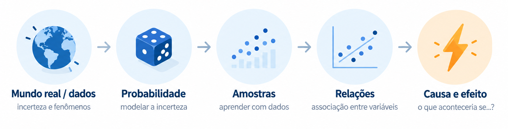

Estas são as notas de aula do curso **Fundamentos para Inferência Causal**.

{.course-figure width="80%"}

O objetivo do curso é construir, passo a passo, os fundamentos necessários para compreender Inferência Causal de forma rigorosa, conectando teoria e aplicações reais.

> Apenas quem se matriculou tem acesso a esse conteúdo. Todo o material é **propriedade privada, protegido, e rastreável**. O uso é restrito exclusivamente aos alunos matriculados no curso, durante o período de sua realização.

O percurso principal será:

- Pré-Curso (Revisão de Matemática Básica)
- Probabilidade
- Inferência Estatística
- Regressão
- Inferência Causal

As aulas são realizadas **ao vivo**. Estas notas funcionam como material de apoio, estudo e consulta.