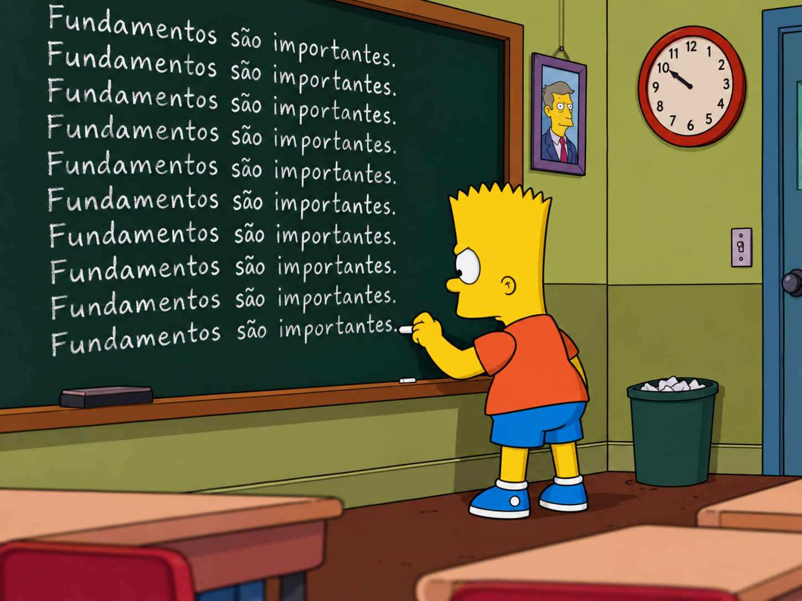

{.course-figure width="60%"}

Estas são as **notas de aula aprofundadas** do nosso curso **Fundamentos para Inferência Causal**.

O objetivo do curso é construir, passo a passo, os fundamentos necessários para compreender Inferência Causal de forma rigorosa, conectando teoria e aplicações reais.

> Apenas quem se matriculou tem acesso a esse conteúdo. Todo o material é **propriedade privada, protegido, e rastreável**. O uso é restrito exclusivamente aos alunos matriculados no curso, durante o período de sua realização.

O percurso principal será:

- Probabilidade
- Inferência Estatística
- Regressão
- Inferência Causal

Estas notas aprofundadas funcionam como material de apoio, estudo e consulta.